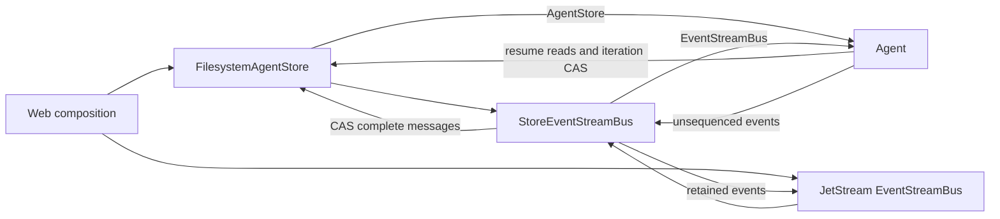
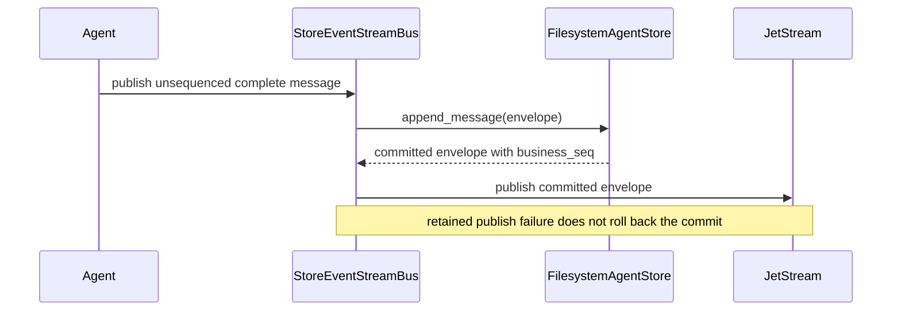
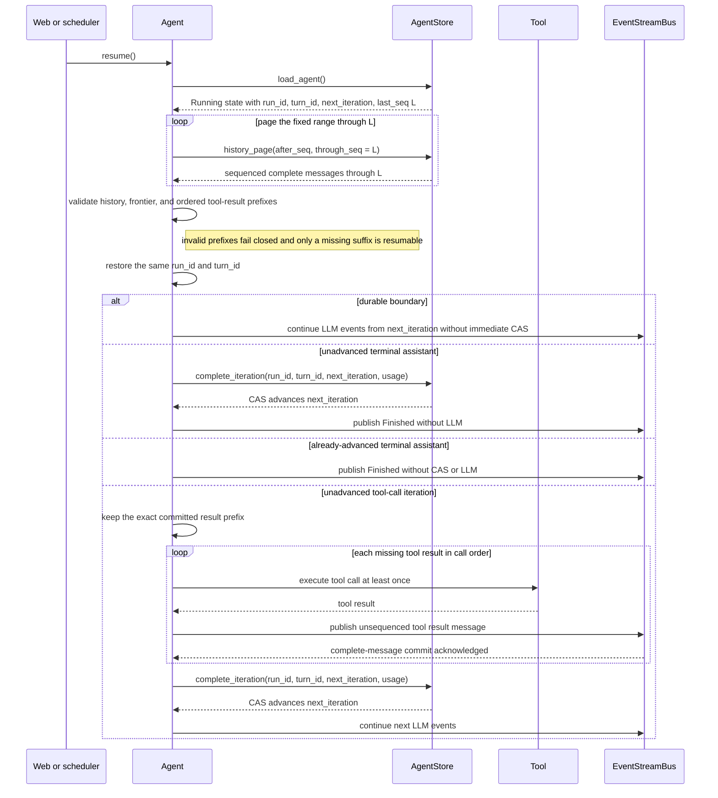
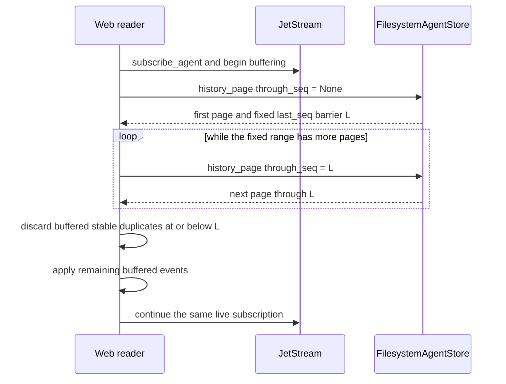

# Runtime event persistence conventions

## Foundational agent-loop event contracts

- `DurableAgentEvent` and `AgentTelemetryEvent` are local, scope-free events emitted by the
  foundational `AgentLoop`; they are not wire envelopes and must not acquire run/agent/turn
  fields merely for a transport adapter.
- `DurableAgentEvent` names loop correctness boundaries. The loop waits for the injected durable
  sink acknowledgement before advancing. This does not mean every variant becomes an AgentStore
  history row; persistence policy belongs to the composition and projection layers.
- `AgentTelemetryEvent` is best-effort observability. Dropped, timed-out, unsupported, or failed
  telemetry must never change loop output, tool dispatch, durable frontier, or terminal status.
- `ToolExecutionStarted` is durable and occurs after tool lookup/input validation/approval but before
  dispatch. `IterationCompleted` is durable and identifies the exact iteration and cumulative usage
  whose frontier may advance.
- Both enums use stable snake_case `type` names. Adding a variant requires updating `event_type()`,
  serde tests, the scoped projection, protocol docs, and downstream exhaustive projections.

## Wire scope and projection

- `StreamEnvelope` is the transport-facing type. `RuntimeEvent::Agent` nests `AgentEvent`; consumers
  must inspect the nested event type rather than infer it from metadata.
- The current hosted-agent projection has no workflow node context, so `ScopedAgentEventSink` uses
  `EventSource::Run` and carries `agent_id` in `RuntimeEvent::Agent`. Do not rewrite it to
  `EventSource::Agent` without a real `node_id` supplied by orchestration.
- `ScopedAgentEventSink` supplies run/agent/turn scope, projects durable loop events to `AgentEvent`,
  and projects supported telemetry to nested `LlmEvent`. Unsupported telemetry is a safe no-op with
  a warning; unsupported durable events are an error.
- `business_seq`, retained `EventCursor`, and loop `iteration` are independent order domains and
  must never be compared or converted.

## Hosted model configuration

- `stratum-core` owns the common `ModelConfig` snapshot: a provider-scoped `ModelId` and its
  provider-specific parameter object travel together across runtime and persistence boundaries.

## Dependency boundaries

- Web owns mounted-root selection, ACLs, writer authorization, initialization of
  `FilesystemAgentStore`, construction of the independent JetStream bus,
  and injection of both the store as the Agent's `AgentStore` and the decorator
  as its `EventStreamBus`.
- The Agent uses `AgentStore` directly only to load resumable state and fixed
  history and to advance the durable iteration frontier. It publishes every
  event through `EventStreamBus` without a business sequence.
- `StoreEventStreamBus` commits complete messages before forwarding the
  committed envelope, persists required lifecycle state, and passes other
  events directly to its inner retained bus.
- JetStream is an independent file-backed, limits-retained cache. Neither it nor
  `FilesystemAgentStore` owns the other.
- `business_seq` lives on the committed `StreamEnvelope` and is present only for
  complete `AgentEvent::Message` events. `EventCursor` is an independent
  retained-transport position.
- `AgentEvent::IterationCompleted` is projected by `StoreEventStreamBus` through
  `complete_iteration` before retained forwarding. `ToolExecutionStarted` is required by the loop
  sink contract but is not a complete-message history record and receives no `business_seq`.

## Complete-message commit

## Turn resume

Resume uses `last_seq` from the loaded state as an immutable history barrier.
`next_iteration` is the durable iteration frontier, not merely the next LLM
request: all lower iterations have committed stable boundaries, while history at
the frontier may still require reconciliation. Committed tool results must form
the exact ordered prefix of the immediately preceding assistant `tool_calls`.
Unknown, duplicate, sparse, or out-of-order results fail closed as invalid resume
history; only the missing suffix executes. The active turn shape and frontier
select one of the four branches above. Complete messages and lifecycle events
published during resumption still pass through `StoreEventStreamBus` for commit
and retained delivery.

## Fixed-barrier recovery

Fixed-barrier recovery stays in Web or another external reader composition; no
runtime recovery manager owns both stores. The reader never compares an
`EventCursor` with `business_seq`.
