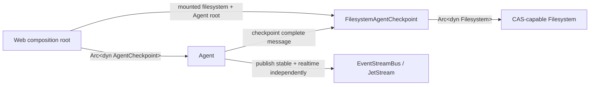
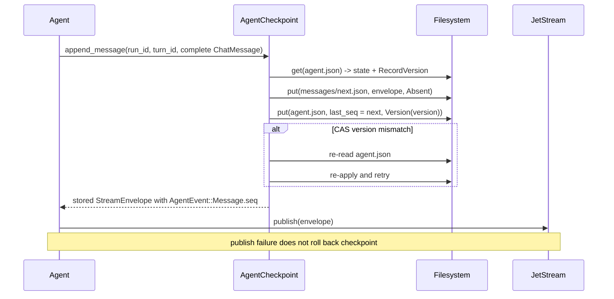
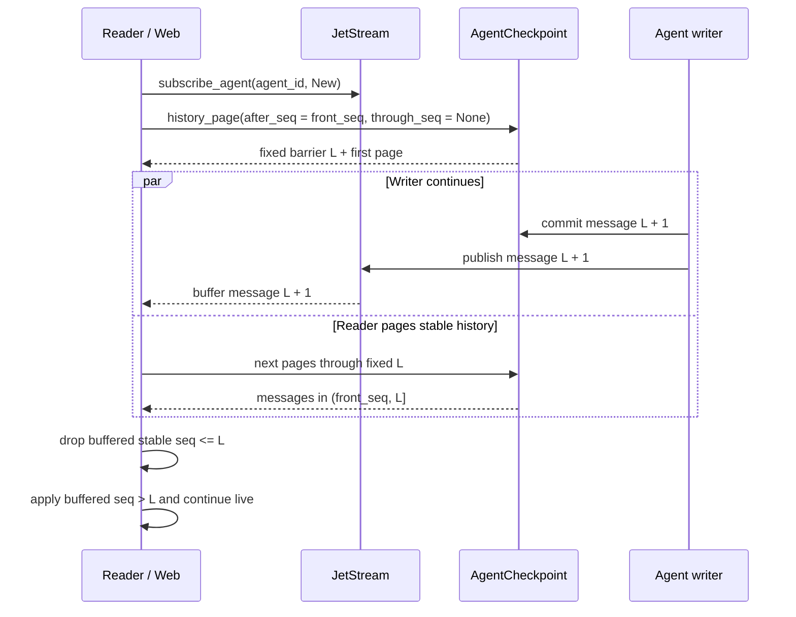

# Agent Checkpoint and Retained Log Implementation Plan

> **For agentic workers:** REQUIRED SUB-SKILL: Use superpowers:subagent-driven-development (recommended) or superpowers:executing-plans to implement this plan task-by-task. Steps use checkbox (`- [ ]`) syntax for tracking.

**Goal:** Replace SQLite turn snapshots with an Agent-scoped, mounted-filesystem checkpoint; assign business sequence numbers only to complete messages; and expose an independent JetStream retained log with cursor-based replay.

**Architecture:** `Agent` receives a required `Arc<dyn AgentCheckpoint>`. `FilesystemAgentCheckpoint` receives an already-authorized `Arc<dyn Filesystem>` plus an Agent-root `VirtualPath`, allocates `seq`, writes immutable message files, and CAS-advances `agent.json.last_seq`. `EventStreamBus` independently publishes and replays Agent events by opaque transport cursor; stable recovery always comes from checkpoint history.

**Tech Stack:** Rust 2024, Tokio, async-trait, serde/serde_json, chrono, tracing, async-nats JetStream, mounted `wyse-filesystem`.

## Global Constraints

- Before executing Task 1, use `superpowers:using-git-worktrees`; do not implement in the current checkout and do not commit on `main`.
- Rust version remains `1.88`; do not raise the workspace version floor.
- There is no data migration, compatibility adapter, dual write, feature flag, or legacy fallback.
- Delete `SqliteCheckpointStore`, `CheckpointRecord`, `CheckpointKind`, `CheckpointId`, the history BLOB codec, and tests that exist only for those contracts.
- `Agent -> Arc<dyn AgentCheckpoint> -> Arc<dyn Filesystem>` is the only checkpoint dependency chain. `Agent` never receives a filesystem handle.
- Web crates provide the mounted Agent root and enforce creator-only writes plus shared reads. Lower crates do not create mounts, owners, ACLs, or write leases.
- `agent.json` contains only `state_version`, `agent_id`, `name`, `status`, `run_id`, `turn_id`, `usage`, `last_seq`, and `updated_at`.
- Only complete user, assistant, and tool `ChatMessage` events receive Agent-lifetime `seq`; text, reasoning, tool-call deltas, and lifecycle events remain unsequenced.
- Every committed `seq <= last_seq` must have a valid immutable `messages/{seq}.json`. Message file creation uses `CasExpectation::Absent`; only `agent.json` is CAS-updated.
- Business code never uses `CasExpectation::Any`. Unsupported CAS fails closed; do not add a per-record Tokio mutex.
- Checkpoint commit and JetStream publish are independent. A publish failure never rolls checkpoint state back.
- JetStream uses file storage and explicit `max_age`, `max_bytes`, `max_messages`, discard-old, and replica settings.
- Do not add new `wyse` prefixes to subjects, stream names, inbox names, paths, or protocol types.
- `TODO.md`, `crates/wyse-core/AGENTS.md`, and all `docs/superpowers/` documents remain local and uncommitted.

## File Map

- `crates/wyse-filesystem/src/record.rs`: file-entry and CAS value types only.
- `crates/wyse-filesystem/src/cas.rs`: bounded optimistic retry loop only.
- `crates/wyse-filesystem/src/definition.rs`: `Filesystem::get`/`put` interface defaults and existing file operations.
- `crates/wyse-filesystem/src/error.rs`: version mismatch, unsupported CAS, timeout-facing filesystem errors.
- `crates/wyse-core/src/lib.rs`: event envelope, stable message event, replay cursor, and history page protocol types.
- `crates/wyse-checkpoint/src/definition.rs`: `AgentCheckpoint` trait only.
- `crates/wyse-checkpoint/src/state.rs`: strict persisted `AgentState` and `AgentStatus`.
- `crates/wyse-checkpoint/src/filesystem.rs`: mounted-filesystem implementation, validation, append/reconciliation, and pagination.
- `crates/wyse-checkpoint/src/error.rs`: typed checkpoint failures only.
- `crates/wyse-checkpoint/tests/support/mod.rs`: test-only CAS filesystem; never exported by production code.
- `crates/wyse-checkpoint/tests/filesystem_checkpoint.rs`: checkpoint integration behavior.
- `crates/wyse-infra/src/event_stream_bus/definition.rs`: replay-aware bus interface and explicit JetStream retention config.
- `crates/wyse-infra/src/event_stream_bus/memory.rs`: in-memory retained log with transport cursors.
- `crates/wyse-infra/src/event_stream_bus/nats.rs`: Agent-scoped JetStream subjects and cursor replay.
- `crates/wyse-agent/src/definition.rs`: required checkpoint injection and restore.
- `crates/wyse-agent/src/loop.rs`: stable message checkpointing plus independent realtime publication.
- `crates/wyse-agent/tests/streaming_loop.rs`: end-to-end Agent persistence/event behavior, with old BLOB tests removed.
- `TODO.md`: deferred capabilities only; updated in the final task.
- `crates/wyse-core/AGENTS.md`: stable conventions and Mermaid diagrams; created in the final task.

---

### Task 1: Add filesystem CAS primitives and bounded retry

**Files:**
- Create: `crates/wyse-filesystem/src/record.rs`
- Create: `crates/wyse-filesystem/src/cas.rs`
- Modify: `crates/wyse-filesystem/src/definition.rs`
- Modify: `crates/wyse-filesystem/src/error.rs`
- Modify: `crates/wyse-filesystem/src/lib.rs`
- Test: `crates/wyse-filesystem/src/cas.rs`
- Test: `crates/wyse-filesystem/src/local.rs`

**Interfaces:**
- Consumes: existing `Filesystem`, `FilesystemError`, and `VirtualPath`.
- Produces: `Entry`, `RecordVersion`, `VersionedEntry`, `CasExpectation`, `Filesystem::get`, `Filesystem::put`, `cas_update`, and `CasUpdateError<E>` for Task 4.

- [ ] **Step 1: Add failing tests for equality-only versions, CAS retry, and fail-closed mounts**

Add tests that construct a scripted filesystem with version `1`, force one `VersionMismatch`, then accept version `2`. The apply closure must be observed exactly twice. Also call `LocalFilesystem::get` and assert `FilesystemError::UnsupportedCas` rather than falling back to `write_file`.

```rust
#[tokio::test]
async fn cas_update_reloads_and_reapplies_after_version_mismatch() {
    let filesystem = ScriptedFilesystem::with_one_conflict(vec![1]);
    let path = VirtualPath::try_from("/agent.json").expect("valid path");
    let applies = AtomicUsize::new(0);

    let updated = cas_update(
        &filesystem,
        &path,
        |entry| Ok::<u8, Infallible>(entry.contents()[0]),
        |value| Ok::<Entry, Infallible>(Entry::new(vec![*value])),
        |current| {
            applies.fetch_add(1, Ordering::SeqCst);
            Ok::<u8, Infallible>(*current + 1)
        },
    )
    .await
    .expect("CAS eventually succeeds");

    assert_eq!(updated, 2);
    assert_eq!(applies.load(Ordering::SeqCst), 2);
}

#[tokio::test]
async fn local_filesystem_fails_closed_for_cas() {
    let filesystem = local_filesystem();
    let path = VirtualPath::try_from("/agent.json").expect("valid path");

    let error = filesystem.get(&path).await.expect_err("CAS is unsupported");

    assert!(matches!(error, FilesystemError::UnsupportedCas));
}
```

- [ ] **Step 2: Run the focused tests and confirm the API is missing**

Run: `cargo test -p wyse-filesystem`

Expected: FAIL because `cas_update`, `Entry`, `RecordVersion`, and `Filesystem::get` do not exist.

- [ ] **Step 3: Define the minimal record and CAS types**

Create `record.rs` with no IronClaw-only fields:

```rust
#[derive(Debug, Clone, PartialEq, Eq)]
pub struct Entry {
    contents: Vec<u8>,
}

impl Entry {
    #[must_use]
    pub fn new(contents: Vec<u8>) -> Self {
        Self { contents }
    }

    #[must_use]
    pub fn contents(&self) -> &[u8] {
        &self.contents
    }

    #[must_use]
    pub fn into_contents(self) -> Vec<u8> {
        self.contents
    }
}

#[derive(Debug, Clone, Copy, PartialEq, Eq, Hash)]
pub struct RecordVersion(u64);

impl RecordVersion {
    #[doc(hidden)]
    #[must_use]
    pub const fn from_backend(value: u64) -> Self {
        Self(value)
    }
}

#[derive(Debug, Clone, Copy, PartialEq, Eq)]
pub enum CasExpectation {
    Absent,
    Version(RecordVersion),
    Any,
}

#[derive(Debug, Clone, PartialEq, Eq)]
pub struct VersionedEntry {
    pub entry: Entry,
    pub version: RecordVersion,
}
```

Add object-safe default methods to `Filesystem`; defaults are deliberately unsupported so `LocalFilesystem` cannot claim process-safe CAS:

```rust
async fn get(
    &self,
    _path: &VirtualPath,
) -> Result<Option<VersionedEntry>, FilesystemError> {
    Err(FilesystemError::UnsupportedCas)
}

async fn put(
    &self,
    _path: &VirtualPath,
    _entry: Entry,
    _cas: CasExpectation,
) -> Result<RecordVersion, FilesystemError> {
    Err(FilesystemError::UnsupportedCas)
}
```

Add these exact errors:

```rust
#[error("filesystem backend does not support compare-and-swap")]
UnsupportedCas,

#[error("record version mismatch {path}")]
VersionMismatch { path: VirtualPath },

#[error("record version overflow {path}")]
VersionOverflow { path: VirtualPath },
```

- [ ] **Step 4: Implement the shared retry helper**

In `cas.rs`, use 32 attempts, a 15-second outer timeout, and jittered exponential sleep capped at 50 ms. Re-read and re-run `apply` after every mismatch; never turn unsupported CAS into `Any`.

```rust
pub const FILESYSTEM_CAS_RETRIES: usize = 32;
pub const FILESYSTEM_APPLY_TIMEOUT: Duration = Duration::from_secs(15);
const INITIAL_BACKOFF: Duration = Duration::from_millis(2);
const MAX_BACKOFF: Duration = Duration::from_millis(50);

#[derive(Debug, thiserror::Error)]
pub enum CasUpdateError<E: std::error::Error + 'static> {
    #[error("filesystem backend does not support compare-and-swap")]
    CasUnsupported,
    #[error("compare-and-swap update timed out")]
    Timeout,
    #[error("compare-and-swap retries exhausted")]
    RetriesExhausted,
    #[error("filesystem operation failed")]
    Filesystem(#[source] FilesystemError),
    #[error("compare-and-swap apply failed")]
    Apply(#[source] E),
}

pub async fn cas_update<T, E, Decode, Encode, Apply>(
    filesystem: &dyn Filesystem,
    path: &VirtualPath,
    decode: Decode,
    encode: Encode,
    apply: Apply,
) -> Result<T, CasUpdateError<E>>
where
    E: std::error::Error + Send + Sync + 'static,
    Decode: Fn(&Entry) -> Result<T, E>,
    Encode: Fn(&T) -> Result<Entry, E>,
    Apply: Fn(&T) -> Result<T, E>,
{
    timeout(
        FILESYSTEM_APPLY_TIMEOUT,
        cas_update_inner(filesystem, path, &decode, &encode, &apply),
    )
    .await
    .map_err(|_| CasUpdateError::Timeout)?
}
```

`cas_update_inner` must return `NotFound` when `get` returns `None`, map `UnsupportedCas` to `CasUnsupported`, retry only `VersionMismatch`, and return `RetriesExhausted` after the 32nd failed write.

```rust
async fn cas_update_inner<T, E, Decode, Encode, Apply>(
    filesystem: &dyn Filesystem,
    path: &VirtualPath,
    decode: &Decode,
    encode: &Encode,
    apply: &Apply,
) -> Result<T, CasUpdateError<E>>
where
    E: std::error::Error + Send + Sync + 'static,
    Decode: Fn(&Entry) -> Result<T, E>,
    Encode: Fn(&T) -> Result<Entry, E>,
    Apply: Fn(&T) -> Result<T, E>,
{
    for attempt in 0..FILESYSTEM_CAS_RETRIES {
        let current = match filesystem.get(path).await {
            Ok(Some(current)) => current,
            Ok(None) => {
                return Err(CasUpdateError::Filesystem(FilesystemError::NotFound {
                    path: path.clone(),
                }));
            }
            Err(FilesystemError::UnsupportedCas) => {
                return Err(CasUpdateError::CasUnsupported);
            }
            Err(error) => return Err(CasUpdateError::Filesystem(error)),
        };
        let decoded = decode(&current.entry).map_err(CasUpdateError::Apply)?;
        let next = apply(&decoded).map_err(CasUpdateError::Apply)?;
        let entry = encode(&next).map_err(CasUpdateError::Apply)?;

        match filesystem
            .put(path, entry, CasExpectation::Version(current.version))
            .await
        {
            Ok(_) => return Ok(next),
            Err(FilesystemError::VersionMismatch { .. })
                if attempt + 1 < FILESYSTEM_CAS_RETRIES =>
            {
                sleep(jittered_backoff(attempt)).await;
            }
            Err(FilesystemError::VersionMismatch { .. }) => {
                return Err(CasUpdateError::RetriesExhausted);
            }
            Err(FilesystemError::UnsupportedCas) => {
                return Err(CasUpdateError::CasUnsupported);
            }
            Err(error) => return Err(CasUpdateError::Filesystem(error)),
        }
    }
    Err(CasUpdateError::RetriesExhausted)
}

fn jittered_backoff(attempt: usize) -> Duration {
    let shift = u32::try_from(attempt.min(5)).expect("attempt fits u32");
    let base_ms = 2_u64.saturating_mul(1_u64 << shift).min(50);
    let nanos = SystemTime::now()
        .duration_since(UNIX_EPOCH)
        .unwrap_or_default()
        .subsec_nanos();
    let jitter_ms = u64::from(nanos) % (base_ms / 2 + 1);
    Duration::from_millis((base_ms + jitter_ms).min(50))
}
```

- [ ] **Step 5: Run filesystem tests and lint the crate**

Run: `cargo test -p wyse-filesystem`

Expected: PASS, including the pre-existing sandbox/symlink tests and the new CAS tests.

Run: `cargo clippy -p wyse-filesystem --all-targets -- -D warnings`

Expected: PASS with no `await` held under a mutex guard and no `CasExpectation::Any` in `cas.rs`.

- [ ] **Step 6: Commit the CAS primitive**

```bash
git add crates/wyse-filesystem/src
git commit -m "feat(filesystem): add optimistic cas primitives"
```

### Task 2: Define message sequence, replay cursor, and history protocols

**Files:**
- Modify: `crates/wyse-core/src/lib.rs:549-675`
- Test: `crates/wyse-core/src/lib.rs`
- Mechanically update `StreamEnvelope` literals in: `crates/wyse-agent/src`, `crates/wyse-agent/tests`, `crates/wyse-infra/src`, `crates/wyse-infra/tests`

**Interfaces:**
- Consumes: existing `AgentId`, `RunId`, `TurnId`, `ChatMessage`, `TokenUsage`, `RuntimeEvent`, and `StreamEnvelope`.
- Produces: unsequenced `StreamEnvelope`, `AgentEvent::Message`, `EventCursor`, `ReplayStart`, `EventRecord`, `HistoryQuery`, and `HistoryPage` for Tasks 3–7.

- [ ] **Step 1: Write protocol serialization tests**

```rust
#[test]
fn only_complete_agent_message_has_business_sequence() {
    let message = AgentEvent::Message {
        seq: 7,
        turn_id: TurnId::new(),
        message: ChatMessage::user("hello"),
    };
    let delta = AgentEvent::Llm {
        llm_call_id: LlmCallId::from("llm-call-1"),
        event: LlmEvent::TextDelta {
            role: LlmCallRole::Assistant,
            delta: "hel".to_owned(),
        },
    };

    assert_eq!(message.business_seq(), Some(7));
    assert_eq!(delta.business_seq(), None);
}

#[test]
fn stream_envelope_has_no_top_level_sequence() {
    let value = serde_json::to_value(agent_envelope(AgentEvent::Started))
        .expect("serialize envelope");

    assert!(value.get("seq").is_none());
}

#[test]
fn event_cursor_is_not_ordered_with_business_sequence() {
    let cursor = EventCursor::from_transport_sequence(12);
    assert_eq!(cursor.transport_sequence(), 12);
}
```

- [ ] **Step 2: Run the focused core tests and verify failure**

Run: `cargo test -p wyse-core --lib`

Expected: FAIL because the new event and cursor APIs are absent and `StreamEnvelope.seq` still serializes.

- [ ] **Step 3: Add the stable message event and remove universal sequence**

Add the variant and helper without adding `MessageCommitted`:

```rust
pub enum AgentEvent {
    Message {
        seq: u64,
        turn_id: TurnId,
        message: ChatMessage,
    },
    Started,
    Finished {
        finish_reason: String,
        usage: TokenUsage,
    },
    Failed {
        error_text: String,
    },
    Cancelled,
    Llm {
        llm_call_id: LlmCallId,
        event: LlmEvent,
    },
}

impl AgentEvent {
    #[must_use]
    pub const fn business_seq(&self) -> Option<u64> {
        match self {
            Self::Message { seq, .. } => Some(*seq),
            Self::Started
            | Self::Finished { .. }
            | Self::Failed { .. }
            | Self::Cancelled
            | Self::Llm { .. } => None,
        }
    }

    #[must_use]
    pub const fn event_type(&self) -> &'static str {
        match self {
            Self::Message { .. } => "message",
            Self::Started => "started",
            Self::Finished { .. } => "finished",
            Self::Failed { .. } => "failed",
            Self::Cancelled => "cancelled",
            Self::Llm { .. } => "llm",
        }
    }
}

impl RuntimeEvent {
    #[must_use]
    pub const fn business_seq(&self) -> Option<u64> {
        match self {
            Self::Agent { event, .. } => event.business_seq(),
            Self::RunStarted
            | Self::RunFinished { .. }
            | Self::RunFailed { .. }
            | Self::RunCancelled
            | Self::NodeStarted
            | Self::NodeOutput { .. }
            | Self::NodeFinished
            | Self::NodeFailed { .. }
            | Self::Llm { .. }
            | Self::PlanUpdated { .. } => None,
        }
    }
}

pub struct StreamEnvelope {
    pub run_id: RunId,
    pub timestamp: DateTime<Utc>,
    pub source: EventSource,
    pub event: RuntimeEvent,
    #[serde(default, skip_serializing_if = "BTreeMap::is_empty")]
    pub metadata: BTreeMap<String, Value>,
}
```

- [ ] **Step 4: Add transport replay and fixed-range history types**

```rust
#[derive(Debug, Clone, Copy, PartialEq, Eq, Hash, Serialize, Deserialize)]
#[serde(transparent)]
pub struct EventCursor(u64);

impl EventCursor {
    #[doc(hidden)]
    #[must_use]
    pub const fn from_transport_sequence(value: u64) -> Self {
        Self(value)
    }

    #[doc(hidden)]
    #[must_use]
    pub const fn transport_sequence(self) -> u64 {
        self.0
    }
}

#[derive(Debug, Clone, Copy, PartialEq, Eq, Serialize, Deserialize)]
#[serde(rename_all = "snake_case")]
pub enum ReplayStart {
    All,
    After(EventCursor),
    New,
}

#[derive(Debug, Clone, PartialEq, Serialize, Deserialize)]
pub struct EventRecord {
    pub cursor: EventCursor,
    pub envelope: StreamEnvelope,
}

#[derive(Debug, Clone, Copy, PartialEq, Eq, Serialize, Deserialize)]
pub struct HistoryQuery {
    pub after_seq: u64,
    pub through_seq: Option<u64>,
    pub limit: usize,
}

#[derive(Debug, Clone, PartialEq, Serialize, Deserialize)]
pub struct HistoryPage {
    pub through_seq: u64,
    pub events: Vec<StreamEnvelope>,
    pub next_front_seq: u64,
    pub has_more: bool,
}
```

Do not derive `PartialOrd` or `Ord` for `EventCursor`, and do not add conversions between `EventCursor` and message `seq`.

- [ ] **Step 5: Remove `seq` from all envelope literals**

Run: `rg -n 'StreamEnvelope \{' crates --glob '*.rs'`

For each literal, delete only the top-level `seq` field. Do not move it into metadata. In NATS code, remove `Nats-Msg-Id` generation because there is no universal event ID; Task 6 will add cursor delivery without inventing a replacement ID.

- [ ] **Step 6: Run core tests and compile all direct consumers**

Run: `cargo test -p wyse-core`

Expected: PASS.

Run: `cargo check -p wyse-agent -p wyse-infra -p wyse-checkpoint --all-targets`

Expected: PASS after all envelope literals and exhaustive event matches include `AgentEvent::Message`.

- [ ] **Step 7: Commit the protocol change**

```bash
git add crates/wyse-core/src/lib.rs crates/wyse-agent crates/wyse-infra
git commit -m "feat(core): sequence only complete agent messages"
```

### Task 3: Replace the generic SQLite checkpoint model with Agent state

**Files:**
- Delete: `crates/wyse-checkpoint/src/sqlite.rs`
- Create: `crates/wyse-checkpoint/src/state.rs`
- Replace: `crates/wyse-checkpoint/src/definition.rs`
- Replace: `crates/wyse-checkpoint/src/error.rs`
- Modify: `crates/wyse-checkpoint/src/lib.rs`
- Modify: `crates/wyse-checkpoint/Cargo.toml`
- Modify: `Cargo.toml`
- Test: `crates/wyse-checkpoint/src/state.rs`

**Interfaces:**
- Consumes: Task 2 protocol types and Task 1 `FilesystemError`/`CasUpdateError`.
- Produces: `AgentState`, `AgentStatus`, `AgentCheckpoint`, `CheckpointError`, and `MAX_HISTORY_PAGE_SIZE` for Tasks 4 and 7.

- [ ] **Step 1: Write strict state-shape tests**

```rust
#[test]
fn agent_state_serializes_only_approved_fields() {
    let state = AgentState::new(AgentId::new(), "writer".to_owned());
    let value = serde_json::to_value(state).expect("serialize state");
    let keys = value.as_object().expect("state object").keys().cloned().collect::<BTreeSet<_>>();

    assert_eq!(
        keys,
        BTreeSet::from([
            "agent_id".to_owned(),
            "last_seq".to_owned(),
            "name".to_owned(),
            "run_id".to_owned(),
            "state_version".to_owned(),
            "status".to_owned(),
            "turn_id".to_owned(),
            "updated_at".to_owned(),
            "usage".to_owned(),
        ])
    );
}

#[test]
fn agent_state_rejects_unknown_fields() {
    let mut value = serde_json::to_value(AgentState::new(AgentId::new(), "writer".to_owned()))
        .expect("serialize state");
    value.as_object_mut().expect("state object").insert("owner_id".to_owned(), json!("x"));

    assert!(serde_json::from_value::<AgentState>(value).is_err());
}
```

- [ ] **Step 2: Run tests and confirm old types do not satisfy the contract**

Run: `cargo test -p wyse-checkpoint --lib`

Expected: FAIL because `AgentState` and `AgentStatus` do not exist.

- [ ] **Step 3: Define strict persisted state**

```rust
pub const AGENT_STATE_VERSION: u32 = 1;
pub const MAX_HISTORY_PAGE_SIZE: usize = 256;

#[derive(Debug, Clone, Copy, PartialEq, Eq, Serialize, Deserialize)]
#[serde(rename_all = "snake_case")]
pub enum AgentStatus {
    Idle,
    Running,
    WaitingRetry,
    Failed,
    Cancelled,
}

#[derive(Debug, Clone, PartialEq, Eq, Serialize, Deserialize)]
#[serde(deny_unknown_fields)]
pub struct AgentState {
    pub state_version: u32,
    pub agent_id: AgentId,
    pub name: String,
    pub status: AgentStatus,
    pub run_id: Option<RunId>,
    pub turn_id: Option<TurnId>,
    pub usage: TokenUsage,
    pub last_seq: u64,
    pub updated_at: DateTime<Utc>,
}

impl AgentState {
    #[must_use]
    pub fn new(agent_id: AgentId, name: String) -> Self {
        Self {
            state_version: AGENT_STATE_VERSION,
            agent_id,
            name,
            status: AgentStatus::Idle,
            run_id: None,
            turn_id: None,
            usage: TokenUsage::default(),
            last_seq: 0,
            updated_at: Utc::now(),
        }
    }
}
```

- [ ] **Step 4: Replace the old trait with the injected Agent-specific interface**

Use `async_trait` because the trait must remain object-safe behind `Arc<dyn AgentCheckpoint>`:

```rust
#[async_trait]
pub trait AgentCheckpoint: Send + Sync {
    async fn load_agent(&self) -> Result<AgentState, CheckpointError>;

    async fn update_state(
        &self,
        status: AgentStatus,
        run_id: Option<RunId>,
        turn_id: Option<TurnId>,
        usage: TokenUsage,
    ) -> Result<AgentState, CheckpointError>;

    async fn append_message(
        &self,
        run_id: RunId,
        turn_id: TurnId,
        timestamp: DateTime<Utc>,
        source: EventSource,
        message: ChatMessage,
        metadata: BTreeMap<String, Value>,
    ) -> Result<StreamEnvelope, CheckpointError>;

    async fn history_page(&self, query: HistoryQuery) -> Result<HistoryPage, CheckpointError>;
}
```

- [ ] **Step 5: Replace SQLite errors with filesystem/domain errors**

Include exact typed variants for missing state, state version, sequence overflow, invalid page limits/ranges, malformed state/message JSON, non-message envelopes, Agent/run/turn/seq mismatch, committed gaps, invalid filenames, unsupported CAS, CAS timeout, and exhausted retries. Preserve sources with `#[source]`/`#[from]`; do not use string-only catch-all errors.

```rust
#[derive(Debug, thiserror::Error)]
#[non_exhaustive]
pub enum CheckpointError {
    #[error("checkpoint filesystem operation failed")]
    Filesystem(#[from] FilesystemError),
    #[error("agent checkpoint is missing")]
    AgentMissing,
    #[error("unsupported agent state version: {version}")]
    UnsupportedStateVersion { version: u32 },
    #[error("message sequence overflow")]
    SequenceOverflow,
    #[error("history limit must be between 1 and {maximum}: {actual}")]
    InvalidHistoryLimit { actual: usize, maximum: usize },
    #[error("history front {after_seq} exceeds barrier {through_seq}")]
    InvalidHistoryRange { after_seq: u64, through_seq: u64 },
    #[error("history barrier {through_seq} exceeds committed sequence {last_seq}")]
    HistoryBarrierBeyondLast { through_seq: u64, last_seq: u64 },
    #[error("checkpoint agent mismatch: expected {expected}, actual {actual}")]
    AgentMismatch { expected: AgentId, actual: AgentId },
    #[error("checkpoint run mismatch: expected {expected}, actual {actual}")]
    RunMismatch { expected: RunId, actual: RunId },
    #[error("checkpoint turn mismatch: expected {expected}, actual {actual}")]
    TurnMismatch { expected: TurnId, actual: TurnId },
    #[error("message sequence mismatch: path {path_seq}, event {event_seq}")]
    MessageSequenceMismatch { path_seq: u64, event_seq: u64 },
    #[error("committed message is missing: {seq}")]
    MissingCommittedMessage { seq: u64 },
    #[error("checkpoint file does not contain an agent message")]
    UnexpectedMessageEvent,
    #[error("invalid message filename: {file_name}")]
    InvalidMessageFilename { file_name: String },
    #[error("message {seq} exists beyond allowed frontier {frontier}")]
    MessageBeyondFrontier { seq: u64, frontier: u64 },
    #[error("checkpoint backend does not support compare-and-swap")]
    CasUnsupported,
    #[error("checkpoint compare-and-swap timed out")]
    CasTimeout,
    #[error("checkpoint compare-and-swap retries exhausted")]
    CasRetriesExhausted,
    #[error("invalid agent state json")]
    DecodeState(#[source] serde_json::Error),
    #[error("invalid message envelope json")]
    DecodeMessage(#[source] serde_json::Error),
    #[error("failed to encode checkpoint json")]
    Encode(#[source] serde_json::Error),
}
```

- [ ] **Step 6: Delete old code and dependencies**

Delete `sqlite.rs`; remove all exports of `CheckpointId`, `CheckpointKind`, `CheckpointRecord`, `CheckpointStatus`, `CheckpointStore`, and `SqliteCheckpointStore`. Remove `rusqlite` and `uuid` from `crates/wyse-checkpoint/Cargo.toml`; add `serde_json`, `tracing`, and `wyse-filesystem`. Remove workspace `rusqlite` only after `rg -n 'rusqlite' crates Cargo.toml` confirms no other crate uses it.

- [ ] **Step 7: Run checkpoint model tests**

Run: `cargo test -p wyse-checkpoint --lib`

Expected: PASS with no SQLite linkage.

- [ ] **Step 8: Commit the new checkpoint contract**

```bash
git add Cargo.toml crates/wyse-checkpoint
git commit -m "refactor(checkpoint): define agent filesystem state"
```

### Task 4: Implement filesystem-backed append, reconciliation, and pagination

**Files:**
- Create: `crates/wyse-checkpoint/src/filesystem.rs`
- Modify: `crates/wyse-checkpoint/src/lib.rs`
- Create: `crates/wyse-checkpoint/tests/support/mod.rs`
- Create: `crates/wyse-checkpoint/tests/filesystem_checkpoint.rs`
- Modify: `crates/wyse-checkpoint/Cargo.toml`

**Interfaces:**
- Consumes: `AgentCheckpoint` from Task 3; CAS types/helper from Task 1; event/history types from Task 2.
- Produces: `FilesystemAgentCheckpoint::new`, `FilesystemAgentCheckpoint::initialize`, and the complete checkpoint behavior used by Tasks 7 and 8.

- [ ] **Step 1: Build a test-only CAS filesystem fixture**

Implement `MemoryCasFilesystem` under `tests/support/mod.rs` with `BTreeMap<VirtualPath, VersionedEntry>`, monotonically increasing `u64` versions, `Absent`/`Version`/`Any` semantics, directory creation/listing, and an opt-in `fail_next_version_write()` hook. Mutex guards must be dropped before every async return; the fixture is test-only and is not exported.

```rust
match cas {
    CasExpectation::Absent if records.contains_key(path) => {
        Err(FilesystemError::VersionMismatch { path: path.clone() })
    }
    CasExpectation::Version(expected)
        if records.get(path).map(|record| record.version) != Some(expected) =>
    {
        Err(FilesystemError::VersionMismatch { path: path.clone() })
    }
    CasExpectation::Absent | CasExpectation::Version(_) | CasExpectation::Any => {
        let version = self.next_version.fetch_add(1, Ordering::SeqCst);
        let version = RecordVersion::from_backend(version);
        records.insert(path.clone(), VersionedEntry { entry, version });
        Ok(version)
    }
}
```

- [ ] **Step 2: Write failing initialization and append tests**

```rust
#[tokio::test]
async fn initialize_and_append_create_exact_files_and_advance_last_seq() {
    let filesystem = Arc::new(MemoryCasFilesystem::default());
    let root = VirtualPath::try_from("/agents/a").expect("valid root");
    let checkpoint = FilesystemAgentCheckpoint::new(filesystem.clone(), root);
    let agent_id = AgentId::new();

    checkpoint.initialize(agent_id, "a".to_owned()).await.expect("initialize");
    let first = checkpoint.append_message(
        RunId::new(),
        TurnId::new(),
        Utc::now(),
        EventSource::Run,
        ChatMessage::user("hello"),
        BTreeMap::new(),
    ).await.expect("append");

    assert_eq!(first.event.business_seq(), Some(1));
    assert!(filesystem.exists("/agents/a/agent.json"));
    assert!(filesystem.exists("/agents/a/messages/1.json"));
    assert_eq!(checkpoint.load_agent().await.expect("state").last_seq, 1);
}
```

- [ ] **Step 3: Run the focused test and verify failure**

Run: `cargo test -p wyse-checkpoint --test filesystem_checkpoint initialize_and_append_create_exact_files_and_advance_last_seq`

Expected: FAIL because `FilesystemAgentCheckpoint` does not exist.

- [ ] **Step 4: Implement initialization and strict codecs**

`FilesystemAgentCheckpoint` stores only the injected filesystem/root. `initialize` creates `messages/`, serializes `AgentState::new`, then calls `put(agent.json, entry, Absent)`. It never creates or resolves a host path.

```rust
#[derive(Clone)]
pub struct FilesystemAgentCheckpoint {
    filesystem: Arc<dyn Filesystem>,
    root: VirtualPath,
}

impl FilesystemAgentCheckpoint {
    #[must_use]
    pub fn new(filesystem: Arc<dyn Filesystem>, root: VirtualPath) -> Self {
        Self { filesystem, root }
    }

    pub async fn initialize(
        &self,
        agent_id: AgentId,
        name: String,
    ) -> Result<AgentState, CheckpointError> {
        let state = AgentState::new(agent_id, name);
        self.filesystem.create_dir(&self.messages_path()?).await?;
        self.filesystem
            .put(
                &self.agent_path()?,
                Entry::new(serde_json::to_vec(&state).map_err(CheckpointError::Encode)?),
                CasExpectation::Absent,
            )
            .await?;
        Ok(state)
    }
}
```

Path helpers generate only `/root/agent.json`, `/root/messages`, and canonical base-10 `/root/messages/{seq}.json`; parse every constructed path back through `VirtualPath`.

- [ ] **Step 5: Implement state updates through CAS**

The `cas_update` apply closure changes only the approved mutable fields and recomputes `updated_at`; it preserves identity/name/version/last_seq from the newly re-read state.

```rust
let updated = cas_update(
    self.filesystem.as_ref(),
    &self.agent_path()?,
    decode_agent_state,
    encode_agent_state,
    |current| {
        validate_state(current)?;
        let mut next = current.clone();
        next.status = status;
        next.run_id = run_id;
        next.turn_id = turn_id;
        next.usage = usage;
        next.updated_at = Utc::now();
        Ok(next)
    },
)
.await
.map_err(map_cas_error)?;
```

- [ ] **Step 6: Implement message-first append and frontier reconciliation**

For `last_seq = n`, checked-add `next`, construct the final `StreamEnvelope` with `AgentEvent::Message { seq: next, turn_id, message }`, write it with `Absent`, then CAS-advance only `last_seq` and `updated_at`. If `messages/{next}.json` already exists, strictly validate Agent/run/turn/path/event sequence, commit that frontier, and retry the caller's append if it is a different envelope.

Never overwrite a message file. Never use `Any`. Log only IDs, sequence, and retry counts.
Emit structured tracing events for CAS retry/exhaustion, frontier reconciliation,
checkpoint corruption, and page latency with `agent_id`, `run_id`, `turn_id`,
`seq`, and numeric counters as fields. Never log message bodies, reasoning,
tool arguments/results, serialized entries, or host paths. These events are the
current metrics-extraction surface; do not add a metrics facade dependency.

- [ ] **Step 7: Add and pass frontier/corruption tests**

Add four concrete tests using fixture methods `insert_entry(path, entry)`,
`remove_entry(path)`, `entry_version(path)`, and `fail_next_version_write()`:

- `load_reconciles_one_valid_frontier_without_rewriting_it`: initialize at
  `last_seq = 0`, insert a valid `messages/1.json`, record its version, call
  `load_agent`, then assert `last_seq == 1` and the message version is unchanged.
- `load_rejects_missing_committed_message`: set `agent.json.last_seq = 2`,
  insert only `messages/1.json`, call `load_agent`, and assert
  `CheckpointError::MissingCommittedMessage { seq: 2 }`.
- `load_rejects_message_filename_body_sequence_mismatch`: insert `2.json`
  containing `AgentEvent::Message { seq: 3, .. }` and assert
  `CheckpointError::MessageSequenceMismatch { path_seq: 2, event_seq: 3 }`.
- `state_update_retry_preserves_concurrently_advanced_last_seq`: arrange a
  version mismatch on the first state write, advance `last_seq` to `1` in the
  fixture before the retry, then assert the returned state has the requested
  status and `last_seq == 1`.

Run: `cargo test -p wyse-checkpoint --test filesystem_checkpoint`

Expected: PASS.

- [ ] **Step 8: Implement fixed-barrier pagination**

Validate `1 <= limit <= 256`. If `through_seq` is absent, snapshot the current `last_seq`; otherwise require it not to exceed current `last_seq`. Reject `after_seq > through_seq`. Read the exact numeric paths in `(after_seq, through_seq]`, at most `limit`, strictly validate each envelope, and return:

```rust
HistoryPage {
    through_seq,
    next_front_seq: events
        .last()
        .and_then(|event| event.event.business_seq())
        .unwrap_or(query.after_seq),
    has_more: next_front_seq < through_seq,
    events,
}
```

Do not list/sort the entire directory on page reads.

- [ ] **Step 9: Add pagination barrier tests**

Test first-page barrier capture, later writer commit at `L + 1`, second page retaining `L`, zero/oversized limit rejection, `after_seq > L`, missing path corruption, and ascending numeric order across `9.json`/`10.json`.

Run: `cargo test -p wyse-checkpoint`

Expected: PASS.

- [ ] **Step 10: Commit filesystem checkpoint storage**

```bash
git add crates/wyse-checkpoint
git commit -m "feat(checkpoint): persist agent messages with filesystem cas"
```

### Task 5: Make the in-memory event bus Agent-scoped and replay-aware

**Files:**
- Modify: `crates/wyse-infra/src/event_stream_bus/definition.rs`
- Modify: `crates/wyse-infra/src/event_stream_bus/error.rs`
- Replace: `crates/wyse-infra/src/event_stream_bus/memory.rs`
- Modify: `crates/wyse-infra/src/event_stream_bus/mod.rs`

**Interfaces:**
- Consumes: Task 2 `AgentId`, `EventCursor`, `EventRecord`, `ReplayStart`, `StreamEnvelope`.
- Produces: `EventStreamBus::subscribe_agent` and correct `All`/`After`/`New` behavior for Tasks 6–8.

- [ ] **Step 1: Replace old run replay tests with cursor tests**

Delete tests whose only assertion is old `subscribe_run` plus universal event `seq`. Add:

```rust
#[tokio::test]
async fn replay_modes_use_transport_cursor_not_message_sequence() {
    let bus = InMemoryEventStreamBus::default();
    let agent_id = AgentId::new();
    bus.publish(agent_envelope(agent_id, AgentEvent::Started)).await.expect("publish 1");
    bus.publish(agent_envelope(agent_id, message_event(99))).await.expect("publish 2");

    let mut all = bus.subscribe_agent(agent_id, ReplayStart::All).await.expect("all");
    let first = all.next().await.expect("first").expect("record");
    let second = all.next().await.expect("second").expect("record");
    assert_eq!(first.cursor.transport_sequence(), 1);
    assert_eq!(second.cursor.transport_sequence(), 2);

    let mut after = bus.subscribe_agent(agent_id, ReplayStart::After(first.cursor)).await.expect("after");
    assert_eq!(after.next().await.expect("second").expect("record"), second);
}
```

- [ ] **Step 2: Run and verify failure**

Run: `cargo test -p wyse-infra replay_modes_use_transport_cursor_not_message_sequence`

Expected: FAIL because `subscribe_agent` and `EventRecord` delivery are not implemented.

- [ ] **Step 3: Change the bus interface**

```rust
pub type EventStream = Pin<
    Box<dyn Stream<Item = Result<EventRecord, EventStreamBusError>> + Send + 'static>,
>;

#[async_trait]
pub trait EventStreamBus: Send + Sync {
    async fn publish(&self, envelope: StreamEnvelope) -> Result<(), EventStreamBusError>;

    async fn subscribe_agent(
        &self,
        agent_id: AgentId,
        replay_start: ReplayStart,
    ) -> Result<EventStream, EventStreamBusError>;
}
```

Add `MissingAgentScope` when `publish` receives a non-`RuntimeEvent::Agent` envelope and `CursorExpired { cursor }` for a retained cursor that no longer exists.

- [ ] **Step 4: Implement retained records per Agent**

Store `BTreeMap<AgentId, Arc<AgentEvents>>`; each `AgentEvents` has `Vec<EventRecord>`, next cursor starting at 1, and `Notify`. Remove the unused capacity constructor/configuration. On subscribe, calculate the initial vector index while holding the history mutex, release it, then use the existing `stream::unfold` notification pattern.

Replay indices are exact:

```rust
let next_index = match replay_start {
    ReplayStart::All => 0,
    ReplayStart::New => history.len(),
    ReplayStart::After(cursor) => history
        .iter()
        .position(|record| record.cursor == cursor)
        .map(|index| index + 1)
        .ok_or(EventStreamBusError::CursorExpired { cursor })?,
};
```

- [ ] **Step 5: Pass replay, live, isolation, and retained-reader tests**

Run: `cargo test -p wyse-infra event_stream_bus::memory`

Expected: PASS for `All`, `After`, `New`, retained-then-live delivery, Agent isolation, explicit expired cursor, and a subscriber reading three retained events without a channel-capacity setting.

- [ ] **Step 6: Commit the in-memory retained log**

```bash
git add crates/wyse-infra/src/event_stream_bus
git commit -m "feat(infra): add agent retained-log replay cursors"
```

### Task 6: Persist the Agent retained log in JetStream

**Files:**
- Modify: `crates/wyse-infra/src/event_stream_bus/definition.rs`
- Replace: `crates/wyse-infra/src/event_stream_bus/nats.rs`
- Replace: `crates/wyse-infra/tests/event_stream_bus_nats.rs`
- Modify: `crates/wyse-infra/docker-compose.test.yml`
- Modify: `crates/wyse-infra/Makefile`

**Interfaces:**
- Consumes: Task 5 replay-aware `EventStreamBus`.
- Produces: file-backed JetStream implementation with Agent subjects and stream-sequence cursors.

- [ ] **Step 1: Define explicit retention configuration and neutral defaults**

```rust
pub struct NatsEventStreamBusConfig {
    pub url: String,
    pub stream_name: String,
    pub subject_prefix: String,
    pub replicas: usize,
    pub max_age: Duration,
    pub max_bytes: i64,
    pub max_messages: i64,
}

impl Default for NatsEventStreamBusConfig {
    fn default() -> Self {
        Self {
            url: "nats://localhost:4222".to_owned(),
            stream_name: "AGENT_EVENTS".to_owned(),
            subject_prefix: "events.agent".to_owned(),
            replicas: 1,
            max_age: Duration::from_secs(7 * 24 * 60 * 60),
            max_bytes: 1_073_741_824,
            max_messages: 1_000_000,
        }
    }
}
```

Reject zero `max_age`, non-positive byte/message limits, and replicas outside `1..=5` with `InvalidConfig` before connecting.

- [ ] **Step 2: Write NATS subject and replay-policy unit tests**

```rust
#[test]
fn agent_subject_has_no_product_prefix() {
    let agent_id = AgentId::new();
    let envelope = agent_envelope(agent_id, AgentEvent::Started);
    assert_eq!(
        subject_for("events.agent", &envelope).expect("agent subject"),
        format!("events.agent.{agent_id}.started")
    );
}

#[test]
fn replay_after_starts_at_next_transport_sequence() {
    let policy = deliver_policy(ReplayStart::After(EventCursor::from_transport_sequence(41)))
        .expect("valid cursor");
    assert_eq!(policy, DeliverPolicy::ByStartSequence { start_sequence: 42 });
}
```

- [ ] **Step 3: Configure the stream with explicit file retention**

```rust
jetstream::stream::Config {
    name: config.stream_name.clone(),
    subjects: vec![format!("{}.>", config.subject_prefix)],
    storage: StorageType::File,
    retention: RetentionPolicy::Limits,
    discard: DiscardPolicy::Old,
    max_age: config.max_age,
    max_bytes: config.max_bytes,
    max_messages: config.max_messages,
    num_replicas: config.replicas,
    ..Default::default()
}
```

Do not add `Nats-Msg-Id`; no universal event ID exists.

- [ ] **Step 4: Implement Agent-scoped publish and subscription**

Publish to `events.agent.<agent_id>.<agent_event_type>`. Create an ordered ephemeral push consumer filtered by `events.agent.<agent_id>.>` with a neutral `_INBOX.agent_events.<subscription_id>` delivery subject.

Map replay modes exactly:

```rust
match replay_start {
    ReplayStart::All => DeliverPolicy::All,
    ReplayStart::New => DeliverPolicy::New,
    ReplayStart::After(cursor) => DeliverPolicy::ByStartSequence {
        start_sequence: cursor
            .transport_sequence()
            .checked_add(1)
            .ok_or(EventStreamBusError::CursorOverflow)?,
    },
}
```

Before creating an `After` consumer, fetch stream info. If `cursor < first_sequence - 1`, return `CursorExpired`; do not silently start at the first retained record. Convert each JetStream message's `message.info()?.stream_sequence` into `EventCursor`, then deserialize the envelope into `EventRecord`.

Wrap message delivery with `StreamExt::scan` and a `terminated: bool`. Yield the
first NATS delivery or JSON decode error, set `terminated = true`, and return
`None` on the next poll. Do not skip malformed retained envelopes and do not
continue the subscription after a delivery error.

Trace publish failures, subscription failures, cursor resets, and delivery
decode failures once at their handling boundary using only `agent_id`,
`run_id`, event type, and transport cursor. Do not record payload bytes or
metadata values.

- [ ] **Step 5: Replace old NATS integration tests and prove server-restart persistence**

Keep tests `#[ignore]`. Name the main tests
`nats_agent_replay_modes_and_isolation` and `nats_reports_expired_cursor`.
Together they cover Agent isolation; `All`, `After`, and `New`; ordered
cursors; and explicit cursor expiry after configured retention/purge. Add
`nats_malformed_payload_terminates_subscription`, which publishes invalid JSON
directly to the Agent subject, observes one `Deserialize` error, then asserts
the event stream ends.

Add two fixed-fixture tests for the Makefile to invoke separately:

```rust
fn restart_fixture_agent_id() -> AgentId {
    "0197f4d0-0000-7000-8000-000000000001"
        .parse()
        .expect("fixed AgentId is valid")
}

fn restart_fixture_envelope() -> StreamEnvelope {
    StreamEnvelope {
        run_id: "0197f4d0-0000-7000-8000-000000000002"
            .parse()
            .expect("fixed RunId is valid"),
        timestamp: DateTime::parse_from_rfc3339("2026-07-11T00:00:00Z")
            .expect("fixed timestamp is valid")
            .with_timezone(&Utc),
        source: EventSource::Run,
        event: RuntimeEvent::Agent {
            agent_id: restart_fixture_agent_id(),
            event: AgentEvent::Started,
        },
        metadata: BTreeMap::new(),
    }
}

#[tokio::test]
#[ignore = "requires NATS JetStream"]
async fn seed_file_backed_event_for_restart() -> Result<(), Box<dyn Error>> {
    let bus = wait_for_bus(&nats_url()).await?;
    bus.publish(restart_fixture_envelope()).await?;
    Ok(())
}

#[tokio::test]
#[ignore = "requires NATS JetStream"]
async fn replay_file_backed_event_after_restart() -> Result<(), Box<dyn Error>> {
    let bus = wait_for_bus(&nats_url()).await?;
    let mut events = bus
        .subscribe_agent(restart_fixture_agent_id(), ReplayStart::All)
        .await?;
    let next = timeout(Duration::from_secs(5), events.next())
        .await?
        .ok_or_else(|| std::io::Error::other("missing retained restart fixture"))?;
    let record = next?;
    assert_eq!(record.envelope, restart_fixture_envelope());
    Ok(())
}
```

The fixed IDs and timestamp let the second process identify the first process's
record. Update `test-integration` to run the seed test, restart only
the NATS service without deleting its volume, wait for readiness, then run the
replay test:

```make
	cargo test -p wyse-infra --test event_stream_bus_nats nats_agent_replay_modes_and_isolation -- --ignored --exact
	cargo test -p wyse-infra --test event_stream_bus_nats nats_reports_expired_cursor -- --ignored --exact
	cargo test -p wyse-infra --test event_stream_bus_nats nats_malformed_payload_terminates_subscription -- --ignored --exact
	cargo test -p wyse-infra --test event_stream_bus_nats seed_file_backed_event_for_restart -- --ignored --exact
	$(COMPOSE) -f $(TEST_COMPOSE_FILE) restart nats-stream
	cargo test -p wyse-infra --test event_stream_bus_nats replay_file_backed_event_after_restart -- --ignored --exact
```

Run: `make -C crates/wyse-infra test-integration`

Expected: PASS against the compose NATS JetStream server; after the server
restart, the second test replays the event seeded before restart.

- [ ] **Step 6: Run unit tests and commit JetStream support**

Run: `cargo test -p wyse-infra --lib`

Expected: PASS.

```bash
git add crates/wyse-infra
git commit -m "feat(infra): retain agent events in jetstream"
```

### Task 7: Inject checkpoint into Agent and persist only complete messages

**Files:**
- Delete: `crates/wyse-agent/src/checkpoint.rs`
- Modify: `crates/wyse-agent/src/lib.rs`
- Modify: `crates/wyse-agent/src/definition.rs`
- Modify: `crates/wyse-agent/src/loop.rs`
- Modify: `crates/wyse-agent/src/error.rs`
- Replace checkpoint portions of: `crates/wyse-agent/tests/streaming_loop.rs`
- Modify: `crates/wyse-agent/Cargo.toml`

**Interfaces:**
- Consumes: Task 3 `AgentCheckpoint`/state, Task 4 file semantics, Task 5 event bus.
- Produces: required checkpoint injection, checkpoint-backed resume, and correct stable/realtime event ordering.

- [ ] **Step 1: Delete old BLOB/legacy tests and add required-injection tests**

Delete `checkpoint_payload_encodes_only_resume_data`, `checkpoint_payload_decodes_legacy_v1_extra_fields`, SQLite-record fixtures, and assertions over repeated latest-row snapshots. Add:

```rust
#[test]
fn builder_requires_checkpoint() {
    let error = base_builder_without_checkpoint().build().expect_err("checkpoint is required");
    assert!(matches!(error, AgentError::MissingBuilderField { field: "checkpoint" }));
}

#[tokio::test]
async fn deltas_are_live_only_and_complete_messages_are_checkpointed() {
    let checkpoint = Arc::new(RecordingAgentCheckpoint::initialized());
    let bus = Arc::new(InMemoryEventStreamBus::default());
    let agent_id = AgentId::new();
    let agent = test_agent(agent_id, checkpoint.clone(), bus.clone());

    let run_id = agent.run_turn(ChatMessage::user("hello")).await.expect("run");
    let records = collect_until_finished(bus, agent_id).await;

    assert!(records.iter().any(is_text_delta));
    assert!(records.iter().filter_map(message_seq).eq([1, 2]));
    assert_eq!(checkpoint.messages().len(), 2);
    assert_eq!(checkpoint.messages()[0].run_id, run_id);
}
```

- [ ] **Step 2: Run tests and confirm current optional/BLOB behavior fails**

Run: `cargo test -p wyse-agent`

Expected: FAIL because checkpoint is optional and complete-message append does not exist.

- [ ] **Step 3: Make checkpoint required and remove Agent-owned sequence**

Change the fields to:

```rust
pub struct Agent {
    pub(crate) checkpoint: Arc<dyn AgentCheckpoint>,
    pub(crate) event_bus: Arc<dyn EventStreamBus>,
}

pub struct AgentBuilder {
    checkpoint: Option<Arc<dyn AgentCheckpoint>>,
}

#[must_use]
pub fn checkpoint(mut self, checkpoint: Arc<dyn AgentCheckpoint>) -> Self {
    self.checkpoint = Some(checkpoint);
    self
}
```

`build` must reject a missing checkpoint and store a non-optional `Arc`. Delete `seq: Arc<AtomicU64>`, `set_next_seq`, `reserve_event_seq`, `CheckpointKind`, `CheckpointRecord`, and all state BLOB encode/decode code.

- [ ] **Step 4: Restore Agent history from checkpoint pages**

Change `AgentBuilder::resume` to load the bound Agent state, require `WaitingRetry`, validate an explicitly configured Agent ID when present, then read pages from `after_seq = 0` through the first returned fixed barrier until `has_more == false`. Extract only `AgentEvent::Message.message` into in-memory LLM history.

```rust
let state = checkpoint.load_agent().await?;
if state.status != AgentStatus::WaitingRetry {
    return Err(AgentError::CheckpointNotRetryable);
}
let history = load_checkpoint_history(checkpoint.as_ref()).await?;
```

Do not restore deltas, lifecycle events, provider config, prompts, tool registries, or event-bus config from checkpoint.

- [ ] **Step 5: Append and publish stable user/assistant/tool messages**

Add one helper:

```rust
async fn checkpoint_message(
    &self,
    turn_id: TurnId,
    message: ChatMessage,
) -> Result<(), AgentError> {
    let envelope = self
        .checkpoint
        .append_message(
            self.current_run().expect("run id is set"),
            turn_id,
            Utc::now(),
            EventSource::Run,
            message,
            self.event_metadata(),
        )
        .await?;

    if let Err(error) = self.event_bus.publish(envelope).await {
        warn!(agent_id = %self.id, source = %error, "failed to publish checkpointed message");
    }
    Ok(())
}
```

Call it exactly once after each complete user input, complete assistant response, and completed tool result/error message. The checkpoint call happens before publication. Continue publishing text/reasoning/tool-call/lifecycle events directly to the bus without checkpoint and without business sequence.

- [ ] **Step 6: Replace status snapshots with field-specific updates**

At run start call `update_state(Running, Some(run_id), Some(turn_id), usage)`. On retryable error call `WaitingRetry`; terminal failure calls `Failed`; cancellation calls `Cancelled`; successful completion returns to `Idle`. These calls preserve `last_seq` inside checkpoint CAS.

- [ ] **Step 7: Keep JetStream failure independent**

Update the existing publish-failure test to assert:

```rust
assert_eq!(checkpoint.load_agent().await.expect("state").status, AgentStatus::Idle);
assert_eq!(checkpoint.load_agent().await.expect("state").last_seq, 2);
assert_eq!(checkpoint.messages().len(), 2);
```

The bus error is logged once; the Agent run and checkpoint commit remain successful.

- [ ] **Step 8: Pass Agent behavior tests**

Retain and rewrite tests that still express current behavior: tool continuation, retry without partial assistant message, resume from stable complete messages, turn limit, cancellation, and tool failure. Delete assertions tied only to old per-event seq, SQLite rows, or legacy JSON fields.

Run: `cargo test -p wyse-agent`

Expected: PASS; stable sequences are Agent-lifetime monotonic across multiple turns and deltas have no sequence.

- [ ] **Step 9: Commit Agent integration**

```bash
git add crates/wyse-agent
git commit -m "feat(agent): inject filesystem checkpoint history"
```

### Task 8: Verify recovery composition and remove stale contracts

**Files:**
- Create: `crates/wyse-checkpoint/tests/recovery_composition.rs`
- Modify: `crates/wyse-checkpoint/Cargo.toml` dev-dependencies only
- Modify only if found by scans: stale references under `crates/wyse-agent`, `crates/wyse-checkpoint`, `crates/wyse-infra`, and root `Cargo.toml`

**Interfaces:**
- Consumes: Tasks 4–7 public interfaces.
- Produces: an integration proof that consumer-first buffering plus a fixed checkpoint barrier does not lose a concurrently committed message; no new orchestration abstraction.

- [ ] **Step 1: Write the consumer-first recovery test**

Use the Task 4 test filesystem and Task 5 in-memory bus. The test itself performs Web-style orchestration; do not add a `RecoveryManager` production type.

```rust
async fn initialized_checkpoint(agent_id: AgentId) -> FilesystemAgentCheckpoint {
    let filesystem = Arc::new(MemoryCasFilesystem::default());
    let root = VirtualPath::try_from("/agents/recovery").expect("valid root");
    let checkpoint = FilesystemAgentCheckpoint::new(filesystem, root);
    checkpoint
        .initialize(agent_id, "recovery".to_owned())
        .await
        .expect("initialize checkpoint");
    checkpoint
}

async fn checkpoint_and_publish(
    checkpoint: &FilesystemAgentCheckpoint,
    bus: &InMemoryEventStreamBus,
    _agent_id: AgentId,
    text: &str,
) {
    let envelope = checkpoint
        .append_message(
            RunId::new(),
            TurnId::new(),
            Utc::now(),
            EventSource::Run,
            ChatMessage::user(text),
            BTreeMap::new(),
        )
        .await
        .expect("append message");
    bus.publish(envelope).await.expect("publish message");
}

#[tokio::test]
async fn consumer_first_recovery_catches_message_after_fixed_barrier() {
    let agent_id = AgentId::new();
    let checkpoint = initialized_checkpoint(agent_id).await;
    let bus = InMemoryEventStreamBus::default();
    checkpoint_and_publish(&checkpoint, &bus, agent_id, "one").await;

    let mut live = bus.subscribe_agent(agent_id, ReplayStart::New).await.expect("subscribe");
    let first_page = checkpoint.history_page(HistoryQuery {
        after_seq: 0,
        through_seq: None,
        limit: 1,
    }).await.expect("history page");
    assert_eq!(first_page.through_seq, 1);

    checkpoint_and_publish(&checkpoint, &bus, agent_id, "two").await;
    let buffered = live.next().await.expect("buffered").expect("record");

    assert_eq!(first_page.events[0].event.business_seq(), Some(1));
    assert_eq!(buffered.envelope.event.business_seq(), Some(2));
}

#[tokio::test]
async fn consumer_first_recovery_deduplicates_message_inside_barrier() {
    let agent_id = AgentId::new();
    let checkpoint = initialized_checkpoint(agent_id).await;
    let bus = InMemoryEventStreamBus::default();
    checkpoint_and_publish(&checkpoint, &bus, agent_id, "one").await;
    let mut live = bus.subscribe_agent(agent_id, ReplayStart::New).await.expect("subscribe");

    checkpoint_and_publish(&checkpoint, &bus, agent_id, "two").await;
    let buffered = live.next().await.expect("buffered").expect("record");
    let page = checkpoint.history_page(HistoryQuery {
        after_seq: 0,
        through_seq: None,
        limit: 256,
    }).await.expect("history page");

    assert_eq!(page.through_seq, 2);
    assert_eq!(buffered.envelope.event.business_seq(), Some(2));
    assert!(buffered.envelope.event.business_seq().is_some_and(|seq| seq <= page.through_seq));
}
```

- [ ] **Step 2: Run the composition test**

Run: `cargo test -p wyse-checkpoint --test recovery_composition`

Expected: PASS; checkpoint and event bus remain independent objects.

- [ ] **Step 3: Scan for forbidden legacy and coupling artifacts**

Run:

```bash
rg -n 'SqliteCheckpointStore|CheckpointRecord|CheckpointKind|CheckpointId|put_latest|latest_turn|subscribe_run|AtomicU64|MessageCommitted|Nats-Msg-Id|wyse\.events|WYSE_EVENTS' crates Cargo.toml
```

Expected: no matches in production or current tests. Remove any matching legacy code/test rather than adapting it.

Run:

```bash
rg -n 'CasExpectation::Any|Arc<dyn Filesystem>|owner_id|acl|lease' crates/wyse-agent crates/wyse-checkpoint
```

Expected: no `Any`; no filesystem dependency in `wyse-agent`; the only checkpoint filesystem field is in `FilesystemAgentCheckpoint`; no ownership/ACL/lease fields.

- [ ] **Step 4: Run full formatting, tests, and clippy**

Run: `cargo fmt --check`

Expected: PASS.

Run: `cargo test --workspace --all-targets`

Expected: PASS; ignored NATS container tests remain ignored.

Run: `cargo clippy --workspace --all-targets -- -D warnings`

Expected: PASS.

- [ ] **Step 5: Commit the recovery proof and final code cleanup**

```bash
git add Cargo.toml crates
git commit -m "test: verify checkpoint retained-log recovery"
```

### Task 9: Update the deferred ledger and archive Mermaid conventions

This is deliberately the final task. No implementation task follows it.

**Files:**
- Replace: `TODO.md`
- Create: `crates/wyse-core/AGENTS.md`
- Keep uncommitted: `docs/superpowers/specs/2026-07-11-agent-checkpoint-retained-log-design.md`
- Keep uncommitted: `docs/superpowers/plans/2026-07-11-agent-checkpoint-retained-log.md`

**Interfaces:**
- Consumes: the verified final behavior from Tasks 1–8.
- Produces: a deferred-capability ledger and durable human/agent guidance. These files are intentionally not committed in this work session.

- [ ] **Step 1: Replace `TODO.md` with deferred capabilities only**

Remove the stale execution order, milestones, SQLite checkpoint entry, and already-implemented checklist. Write this exact scoped ledger without checkboxes:

```markdown
# Wyse Agent OS Deferred Work

This file records capabilities that current crates intentionally do not implement. It is not an implementation plan or progress checklist.

## `wyse-filesystem`

- Add a durable CAS-capable mounted backend when the Web composition root selects its durable store. `LocalFilesystem` remains a tool sandbox and must not claim cross-process CAS.

## `wyse-checkpoint`

- Add workflow checkpoint formats only when a workflow caller exists.
- Add multi-writer Agent input only if the creator-only writer model is intentionally replaced.

## `wyse-infra`

- Add run- or node-scoped retained-log subscriptions only when non-Agent consumers require them.

## Web crates

- Own Agent creation, mounted-root selection, creator-only write authorization, and shared-read authorization.
- Orchestrate client recovery: create the retained-log consumer first, page a fixed checkpoint barrier, deduplicate stable messages, then continue the same live subscription.
- During recovery, retain unsequenced events only for the snapshot's active run or a later buffered run; discard stale provisional deltas from already-inactive runs.
- Persist client `EventCursor` values and handle explicit cursor-reset responses.
```

- [ ] **Step 2: Create `crates/wyse-core/AGENTS.md` with the dependency diagram**



Accompany it with concise rules: Agent never sees `Filesystem`; Web owns mount/auth; checkpoint never owns JetStream; only `AgentEvent::Message` has business `seq`.

- [ ] **Step 3: Add the message commit sequence diagram**



- [ ] **Step 4: Add the fixed-barrier recovery diagram**



State explicitly that `EventCursor` orders retained delivery and is never compared with message `seq`.

- [ ] **Step 5: Verify documentation and leave it uncommitted**

Run:

```bash
rg -n 'SQLite|MessageCommitted|subscribe_run|wyse\.events|WYSE_EVENTS' TODO.md crates/wyse-core/AGENTS.md
```

Expected: no matches.

Run:

```bash
rg -n '^```mermaid$' crates/wyse-core/AGENTS.md
git diff -- TODO.md crates/wyse-core/AGENTS.md
git status --short
```

Expected: exactly three Mermaid blocks; the TODO contains deferred work rather than execution steps; both documentation files and both `docs/superpowers/` documents remain uncommitted. Do not run `git add` or `git commit` for this task.
