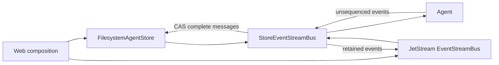

# Agent Event Storage Decorator Implementation Plan

> **For agentic workers:** REQUIRED SUB-SKILL: Use superpowers:subagent-driven-development (recommended) or superpowers:executing-plans to implement this plan task-by-task. Steps use checkbox (`- [ ]`) syntax for tracking.

**Goal:** Remove store persistence from `Agent` and implement complete-message logging plus retained streaming by injecting an `EventStreamBus` decorator.

**Architecture:** `Agent` publishes unsequenced domain envelopes to `Arc<dyn EventStreamBus>`. `StoreEventStreamBus` in `wyse-store` persists state-bearing events, assigns business sequence numbers to complete messages through `FilesystemAgentStore`, and forwards envelopes to an independent inner retained bus. Web composition supplies the mounted filesystem, store, decorator, and JetStream bus; lower crates do not create mounts or writer ownership.

**Tech Stack:** Rust 2024, Tokio, async-trait, serde/serde_json, chrono, tracing, async-nats JetStream, mounted `wyse-filesystem` CAS.

## Global Constraints

- Work only in `/Users/wanyaozhong/projects/wyse-agent-os/.worktrees/agent-checkpoint-retained-log` on branch `codex/agent-checkpoint-retained-log`; never commit on `main`.
- Rust version remains `1.88`; do not add dependencies unless already present in the workspace.
- `wyse-agent` must contain no store dependency, type, field, builder method, codec, sequence allocator, restore method, resume method, or store-specific error.
- The only Agent storage-facing field is `Arc<dyn EventStreamBus>`.
- The dependency chain is `Agent -> EventStreamBus decorator -> AgentStore -> mounted Filesystem`; Web crates compose and authorize it.
- There is no migration, compatibility adapter, dual write, feature flag, or legacy fallback. Delete obsolete implementation and tests.
- `agent.json` contains only `state_version`, `agent_id`, `name`, `status`, `run_id`, `turn_id`, `usage`, `last_seq`, and `updated_at`.
- Only complete user, assistant, and tool messages receive Agent-lifetime business `seq`; text, reasoning, tool-call deltas, approvals, and lifecycle events remain unsequenced.
- Persisted `messages/{seq}.json` and the retained-stream copy carry the same `business_seq = Some(seq)`; Agent-created envelopes carry `None`.
- Message creation uses `CasExpectation::Absent`; only `agent.json` is CAS-updated; business code never uses `CasExpectation::Any`; unsupported CAS fails closed.
- Store commit and JetStream publish are not transactional. A retained-cache publish failure never rolls back a committed store event.
- JetStream remains file-backed with explicit bounded retention. Do not replay store history into JetStream.
- Do not add new `wyse` prefixes to paths, subjects, stream names, or protocol types.
- `TODO.md`, crate `AGENTS.md` files, and `docs/superpowers/` remain local and uncommitted. The final task updates `TODO.md` and the Mermaid archive; no earlier task touches them.
- Follow `.agents/skills/rust-skills/SKILL.md` and ponytail full mode: prefer deletion and existing primitives over new layers.

## File Map

- `crates/wyse-core/src/lib.rs`: uncommitted Agent events and envelope-level business sequence.
- `crates/wyse-store/src/definition.rs`: store interface accepting an unsequenced envelope.
- `crates/wyse-store/src/state.rs`: strict persisted Agent status.
- `crates/wyse-store/src/filesystem.rs`: CAS sequence allocation and envelope commit.
- `crates/wyse-store/src/decorator.rs`: store-backed `EventStreamBus` decorator only.
- `crates/wyse-store/src/error.rs`: store errors only.
- `crates/wyse-infra/src/event_stream_bus/error.rs`: backend-neutral persistence error boundary.
- `crates/wyse-agent/src/definition.rs`: Agent construction and active in-memory state without store.
- `crates/wyse-agent/src/loop.rs`: model/tool loop and event publication only.
- `crates/wyse-agent/src/error.rs`: runtime, LLM, tool, and bus errors only.
- `crates/wyse-agent/tests/streaming_loop.rs`: active-loop and emitted-event behavior only.
- `crates/wyse-agent-builtin/src/default_agent.rs`: default Agent wiring with an injected bus only.
- `crates/wyse-store/tests/decorator.rs`: decorator persistence and forwarding behavior.
- `crates/wyse-store/tests/recovery_composition.rs`: fixed store barrier plus live retained stream.
- `TODO.md`, `crates/wyse-agent-builtin/AGENTS.md`, and `crates/wyse-core/AGENTS.md`: final uncommitted documentation task.

---

### Task 1: Move business sequence out of Agent-created events

**Files:**
- Modify: `crates/wyse-core/src/lib.rs`
- Test: `crates/wyse-core/src/lib.rs`

**Interfaces:**
- Produces: `StreamEnvelope { business_seq: Option<u64>, ... }` and unsequenced `AgentEvent::Message { turn_id, message }` for all later tasks.
- Produces: lifecycle events containing the state data consumed by Task 3.

- [ ] **Step 1: Replace the old sequence test with failing envelope-level assertions**

Construct one complete message envelope with `business_seq: Some(7)` and one `ReasoningDelta` envelope with `None`. Assert `message.business_seq() == Some(7)` and `delta.business_seq() == None`. Add serialization assertions that the message envelope includes `business_seq: 7` and the delta omits the field.

```rust
assert_eq!(message.business_seq(), Some(7));
assert_eq!(delta.business_seq(), None);
assert_eq!(serde_json::to_value(&message)?["business_seq"], json!(7));
assert!(serde_json::to_value(&delta)?.get("business_seq").is_none());
```

- [ ] **Step 2: Run the focused core test and verify RED**

Run: `cargo test -p wyse-core only_complete_agent_message_has_business_sequence`

Expected: compilation fails because `StreamEnvelope` has no `business_seq` field and `AgentEvent::Message` still requires `seq`.

- [ ] **Step 3: Implement the new event contract**

Change the relevant public shapes to:

```rust
pub enum AgentEvent {
    Message { turn_id: TurnId, message: ChatMessage },
    Started { turn_id: TurnId },
    Finished { finish_reason: String, usage: TokenUsage },
    Failed { error_text: String, usage: TokenUsage },
    Cancelled { usage: TokenUsage },
    // keep the current approval and LLM variants
}

pub struct StreamEnvelope {
    #[serde(default, skip_serializing_if = "Option::is_none")]
    pub business_seq: Option<u64>,
    pub run_id: RunId,
    pub timestamp: DateTime<Utc>,
    pub source: EventSource,
    pub event: RuntimeEvent,
    #[serde(default, skip_serializing_if = "BTreeMap::is_empty")]
    pub metadata: BTreeMap<String, Value>,
}

impl StreamEnvelope {
    pub const fn business_seq(&self) -> Option<u64> {
        self.business_seq
    }
}
```

Remove `AgentEvent::business_seq`. Update exhaustive `event_type` matches for `ToolApprovalRequested` and `ToolApprovalResolved` while preserving their snake-case protocol names.

- [ ] **Step 4: Update all core test fixtures and run the crate**

Run: `cargo test -p wyse-core`

Expected: all `wyse-core` tests pass.

- [ ] **Step 5: Commit Task 1**

```bash
git add crates/wyse-core/src/lib.rs
git commit -m "refactor(core): separate event sequence from agent events"
```

---

### Task 2: Make store append commit an unsequenced envelope

**Files:**
- Modify: `crates/wyse-store/src/definition.rs`
- Modify: `crates/wyse-store/src/state.rs`
- Modify: `crates/wyse-store/src/filesystem.rs`
- Modify: `crates/wyse-store/src/error.rs`
- Modify: `crates/wyse-store/tests/filesystem_store.rs`

**Interfaces:**
- Consumes: Task 1 `StreamEnvelope.business_seq`.
- Produces: `AgentStore::append_message(envelope: StreamEnvelope) -> Result<StreamEnvelope, StoreError>` for Task 3.
- Produces: `AgentStatus::{Idle, Running, Finished, Failed, Cancelled}`.

- [ ] **Step 1: Rewrite append fixtures to supply an unsequenced message envelope**

The helper must create:

```rust
StreamEnvelope {
    business_seq: None,
    run_id,
    timestamp: Utc::now(),
    source: EventSource::Run,
    event: RuntimeEvent::Agent {
        agent_id,
        event: AgentEvent::Message {
            turn_id,
            message: ChatMessage::user("message"),
        },
    },
    metadata: BTreeMap::new(),
}
```

Change append tests to call `store.append_message(envelope).await` and assert the returned/stored envelope carries `Some(expected_seq)`.

- [ ] **Step 2: Run the append and state tests and verify RED**

Run: `cargo test -p wyse-store --test filesystem_store`

Expected: compilation fails because `append_message` still accepts decomposed fields and `AgentStatus::Finished` does not exist.

- [ ] **Step 3: Simplify the store trait and state enum**

Use exactly:

```rust
async fn append_message(
    &self,
    envelope: StreamEnvelope,
) -> Result<StreamEnvelope, StoreError>;
```

Replace `WaitingRetry` with `Finished`. Do not add aliases or serde compatibility names.

- [ ] **Step 4: Adapt filesystem append without changing CAS invariants**

Validate that the input is an Agent message for the store Agent and that
`business_seq` is `None`. In each CAS attempt, clone the input, set
`business_seq = Some(state.last_seq + 1)`, write the immutable file with
`Absent`, and CAS-advance `agent.json.last_seq`. Preserve frontier
reconciliation, corruption detection, fixed-range pagination, constant-size
append reads, and retry tracing.

Add a typed error for an input envelope that already has a business sequence:

```rust
#[error("store append requires an unsequenced message")]
MessageAlreadySequenced,
```

- [ ] **Step 5: Run store tests**

Run: `cargo test -p wyse-store --test filesystem_store`

Expected: all filesystem store integration tests pass.

- [ ] **Step 6: Commit Task 2**

```bash
git add crates/wyse-store/src/definition.rs crates/wyse-store/src/state.rs crates/wyse-store/src/filesystem.rs crates/wyse-store/src/error.rs crates/wyse-store/tests/filesystem_store.rs
git commit -m "refactor(store): commit unsequenced message envelopes"
```

---

### Task 3: Add the store-backed event-bus decorator

**Files:**
- Create: `crates/wyse-store/src/decorator.rs`
- Create: `crates/wyse-store/tests/decorator.rs`
- Modify: `crates/wyse-store/src/lib.rs`
- Modify: `crates/wyse-store/Cargo.toml`
- Modify: `crates/wyse-infra/src/event_stream_bus/error.rs`

**Interfaces:**
- Consumes: Task 2 `AgentStore::append_message(StreamEnvelope)`.
- Produces: `StoreEventStreamBus::new(Arc<dyn AgentStore>, Arc<dyn EventStreamBus>) -> Self` implementing `EventStreamBus`.

- [ ] **Step 1: Write decorator tests before production code**

Use a test-only `RecordingStore` and `RecordingBus`. Cover exactly these cases:

1. a message is appended with `business_seq: None`, then the inner bus receives the store-returned `Some(1)` envelope;
2. `Started`, `Finished`, `Failed`, and `Cancelled` map to matching `AgentStatus` updates with run, turn, and usage preserved;
3. LLM deltas never call store and are forwarded unchanged;
4. store failure becomes `EventStreamBusError::Persistence` and the inner bus is not called;
5. inner failure after a committed message is logged and `publish` returns `Ok(())`;
6. `subscribe_agent` delegates the same `AgentId` and `ReplayStart` to the inner bus.

- [ ] **Step 2: Run the decorator test and verify RED**

Run: `cargo test -p wyse-store --test decorator`

Expected: compilation fails because `StoreEventStreamBus` and `EventStreamBusError::Persistence` do not exist.

- [ ] **Step 3: Add a backend-neutral bus persistence error**

Add:

```rust
Persistence {
    source: Box<dyn std::error::Error + Send + Sync + 'static>,
}
```

with display text `event persistence failed`, plus a public constructor:

```rust
pub fn persistence(source: impl Error + Send + Sync + 'static) -> Self
```

Do not make `wyse-infra` depend on `wyse-store`.

- [ ] **Step 4: Implement the minimal decorator**

The struct contains only `store` and `inner`. Its event match performs:

```rust
match &envelope.event {
    RuntimeEvent::Agent { event: AgentEvent::Message { .. }, .. } => {
        let committed = self.store.append_message(envelope).await
            .map_err(EventStreamBusError::persistence)?;
        if let Err(error) = self.inner.publish(committed).await {
            tracing::warn!(source = %error, "committed agent event was not retained");
        }
        Ok(())
    }
    RuntimeEvent::Agent { event: AgentEvent::Started { turn_id }, .. } => {
        self.store.update_state(AgentStatus::Running, Some(envelope.run_id), Some(*turn_id), TokenUsage::default()).await
            .map_err(EventStreamBusError::persistence)?;
        self.forward_committed_state(envelope).await
    }
    // terminal state variants use their usage and the current persisted turn id
    _ => self.inner.publish(envelope).await,
}
```

Use one private helper for the repeated “store committed, inner failure is
warn-only” forwarding rule. Do not add a generic decorator framework.

- [ ] **Step 5: Run decorator and focused store tests**

Run:

```bash
cargo test -p wyse-store --test decorator
cargo test -p wyse-store --test filesystem_store
```

Expected: both focused integration-test binaries pass. The recovery fixture is deliberately updated in Task 5.

- [ ] **Step 6: Commit Task 3**

```bash
git add crates/wyse-infra/src/event_stream_bus/error.rs crates/wyse-store/Cargo.toml crates/wyse-store/src/lib.rs crates/wyse-store/src/decorator.rs crates/wyse-store/tests/decorator.rs
git commit -m "feat(store): decorate retained event publishing"
```

---

### Task 4: Remove store from Agent and publish complete messages

**Files:**
- Modify: `crates/wyse-agent/Cargo.toml`
- Modify: `crates/wyse-agent/src/lib.rs`
- Modify: `crates/wyse-agent/src/definition.rs`
- Modify: `crates/wyse-agent/src/loop.rs`
- Modify: `crates/wyse-agent/src/error.rs`
- Modify: `crates/wyse-agent/tests/streaming_loop.rs`
- Delete if present: `crates/wyse-agent/src/store.rs`

**Interfaces:**
- Consumes: Task 1 unsequenced Agent events.
- Produces: `AgentBuilder` requiring only name, system prompt, LLM provider, tool registry, and `Arc<dyn EventStreamBus>`.

- [ ] **Step 1: Delete store-only test support and add emitted-message assertions**

Remove the legacy recording snapshot store, its wait helper, and these obsolete test families: finished/waiting-retry snapshot persistence, stream-creation retry, publish-versus-store ordering, `resume_turn`, Agent mismatch resume, and persisted status assertions.

Extend the active stream tests to assert that one normal turn emits, in order,
`Started { turn_id }`, user `Message`, assistant `Message`, and `Finished`; all
Agent-created envelopes have `business_seq == None`. Extend the tool test to
assert a tool `Message` is published before the next LLM request completes.

- [ ] **Step 2: Run Agent tests and verify RED**

Run: `cargo test -p wyse-agent --test streaming_loop`

Expected: compilation fails on deleted store APIs and the missing complete-message publication.

- [ ] **Step 3: Delete store construction and resume code**

Remove from `Agent` and `AgentBuilder`:

- `store_store`;
- `seq: AtomicU64`;
- `resumable`;
- `store_store(...)`;
- `resume(...)`;
- `resume_turn(...)`;
- `set_next_seq(...)`;
- store payload imports/module;
- `Store`, `StoreNotRetryable`, and `StoreAgentMismatch` errors.

Remove `wyse-store` from `crates/wyse-agent/Cargo.toml`.

- [ ] **Step 4: Make state-bearing and complete-message publication required**

Every Agent-created `StreamEnvelope` sets `business_seq: None`. At turn start:

```rust
self.publish_required_agent_event(AgentEvent::Started { turn_id }, None).await?;
self.publish_required_agent_event(
    AgentEvent::Message { turn_id, message: input.clone() },
    None,
).await?;
```

Publish the completed assistant message before branching on tool calls. Publish
each completed tool result immediately after execution. Publish terminal events
with `self.current_usage()`:

```rust
AgentEvent::Cancelled { usage: self.current_usage() }
AgentEvent::Failed { error_text: error.to_string(), usage: self.current_usage() }
AgentEvent::Finished { finish_reason, usage: self.current_usage() }
```

Keep LLM lifecycle/delta publication best effort and approval requests required.
Do not mention store or durability in Agent naming, docs, logs, or tests.

- [ ] **Step 5: Run Agent tests and dependency searches**

Run:

```bash
cargo test -p wyse-agent
rg -n "store|Store|resume_turn|store_store|AtomicU64" crates/wyse-agent/Cargo.toml crates/wyse-agent/src crates/wyse-agent/tests
```

Expected: tests pass; `rg` returns no matches.

- [ ] **Step 6: Commit Task 4**

```bash
git add crates/wyse-agent/Cargo.toml crates/wyse-agent/src crates/wyse-agent/tests/streaming_loop.rs
git commit -m "refactor(agent): publish events without storage coupling"
```

---

### Task 5: Compose recovery through the decorator and simplify builtin wiring

**Files:**
- Modify: `crates/wyse-agent-builtin/Cargo.toml`
- Modify: `crates/wyse-agent-builtin/src/default_agent.rs`
- Modify: `crates/wyse-agent-builtin/src/main.rs` if present
- Modify: `crates/wyse-store/tests/recovery_composition.rs`
- Modify: `crates/wyse-infra/src/event_stream_bus/memory.rs`
- Modify: `crates/wyse-infra/src/event_stream_bus/nats.rs`
- Modify: `crates/wyse-infra/tests/event_stream_bus_nats.rs`

**Interfaces:**
- Consumes: Task 3 decorator and Task 4 Agent builder.
- Produces: default Agent construction with only an injected event bus and verified store/live recovery.

- [ ] **Step 1: Change recovery tests to publish through the decorator**

Delete the manual `store_and_publish` helper. Construct:

```rust
let retained = Arc::new(InMemoryEventStreamBus::default());
let bus = StoreEventStreamBus::new(store.clone(), retained.clone());
bus.publish(unsequenced_message_envelope(...)).await?;
```

Keep both race cases: a buffered message above the first-page barrier is
delivered after history, and a buffered message inside the barrier is dropped
as a duplicate. Read business sequence from `StreamEnvelope::business_seq()`.

- [ ] **Step 2: Run recovery and infra tests and verify RED**

Run:

```bash
cargo test -p wyse-store --test recovery_composition
cargo test -p wyse-infra
```

Expected: recovery fixtures or retained-bus fixtures fail until all Task 1 event shape changes are applied.

- [ ] **Step 3: Simplify builtin construction**

Use:

```rust
pub fn build_default_agent(
    agent_id: AgentId,
    event_bus: Arc<dyn EventStreamBus>,
    llm_provider: Arc<dyn LlmProvider>,
) -> Result<Agent, AgentError>
```

Remove the store argument, dependency, and async marker if no await remains.
Do not create the store, filesystem mount, decorator, or JetStream bus in
this crate; Web owns composition.

- [ ] **Step 4: Update retained bus fixtures without changing transport semantics**

Add `business_seq: None` or `Some(seq)` to existing envelopes as appropriate.
Keep NATS `StorageType::File`, bounded retention, Agent-scoped subjects,
`ReplayStart::{All, After, New}`, and opaque transport cursors unchanged. Do not
add store backfill or a new recovery trait.

- [ ] **Step 5: Run the affected crates**

Run:

```bash
cargo test -p wyse-store --test recovery_composition
cargo test -p wyse-infra
cargo test -p wyse-agent-builtin
```

Expected: all tests pass; ignored external NATS tests remain ignored unless their service is explicitly started.

- [ ] **Step 6: Commit Task 5**

```bash
git add crates/wyse-agent-builtin crates/wyse-store/tests/recovery_composition.rs crates/wyse-infra/src/event_stream_bus crates/wyse-infra/tests/event_stream_bus_nats.rs
git commit -m "refactor(agent): compose persistence outside builtin runtime"
```

---

### Task 6: Audit the complete branch and delete obsolete history

**Files:**
- Modify/Delete: only files identified by the searches below as obsolete or inconsistent
- Test: entire workspace

**Interfaces:**
- Consumes: Tasks 1-5 complete architecture.
- Produces: a clean, minimal branch with no alternate storage path.

- [ ] **Step 1: Search for forbidden and obsolete contracts**

Run:

```bash
rg -n "legacy snapshot|resume_turn|WaitingRetry|MessageCommitted|sqlite.*store" crates/*/Cargo.toml crates/*/src crates/*/tests Cargo.toml
rg -n "business_seq|AgentEvent::Message|StreamEnvelope \{" crates
cargo tree -p wyse-agent | rg "wyse-store"
```

Expected: the first command returns no production or test matches; the dependency-tree command returns no match. Inspect every constructor found by the second command and ensure only decorator-committed messages carry `Some(seq)`.

- [ ] **Step 2: Delete stale code and tests found by the audit**

Delete obsolete modules, imports, helpers, dev-dependencies, assertions, and
comments instead of adding compatibility shims. Preserve current tool approval,
LLM, filesystem CAS, pagination, and retained-cursor behavior.

- [ ] **Step 3: Format and run full verification**

Run:

```bash
cargo fmt --all -- --check
cargo test --workspace --all-targets
cargo clippy --workspace --all-targets -- -D warnings
```

Expected: all commands exit 0. External container tests remain `#[ignore]` and do not require NATS for the normal workspace command.

- [ ] **Step 4: Commit Task 6 if the audit changed tracked code**

```bash
git add Cargo.toml Cargo.lock crates
git diff --cached --quiet || git commit -m "refactor: remove obsolete store coupling"
```

---

### Task 7: Update deferred work and Mermaid documentation last

**Files:**
- Modify: `TODO.md`
- Modify: `crates/wyse-agent/AGENTS.md`
- Modify: `crates/wyse-agent-builtin/AGENTS.md`
- Create or Modify: `crates/wyse-core/AGENTS.md`

**Interfaces:**
- Consumes: the verified final implementation from Tasks 1-6.
- Produces: local-only deferred-work notes and final architecture diagrams.

- [ ] **Step 1: Rewrite `TODO.md` as deferred capabilities only**

Remove completed implementation steps. Keep only concrete capabilities this
crate intentionally does not implement, including Web-owned writer ownership,
mount/ACL composition, and a future Web recovery endpoint if it is still absent.
Do not add checklist items for work completed in this plan.

- [ ] **Step 2: Archive the implemented dependency flow in Mermaid**

Add this implemented shape to the relevant crate `AGENTS.md`:



Also diagram the reader barrier: subscribe/buffer, page store through a
fixed `last_seq`, discard buffered stable duplicates, then continue live.
Update `crates/wyse-agent/AGENTS.md` to state that the loop publishes required
complete-message/lifecycle events and has no store or storage dependency.

- [ ] **Step 3: Verify documentation matches code and remains uncommitted**

Run:

```bash
rg -n "store|AgentStore" crates/wyse-agent crates/wyse-agent-builtin
git status --short
git diff -- TODO.md crates/wyse-agent/AGENTS.md crates/wyse-agent-builtin/AGENTS.md crates/wyse-core/AGENTS.md
```

Expected: the first command has no matches. `git status` lists the four local
documentation files as modified/untracked, and none is staged. Do not commit or
stage this task or any `docs/superpowers/` file.
