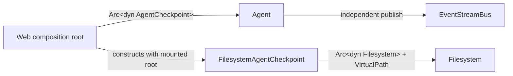

# Agent Checkpoint and Retained-Log Design

## Status

This document records the approved local design for replacing turn-level SQLite
checkpoint snapshots with a mounted-filesystem representation and for combining
that stable history with an independent JetStream retained log.

The document is intentionally uncommitted. After review, only capabilities that
the current crates explicitly defer will be recorded in `TODO.md`. Stable
conventions plus Mermaid diagrams will be copied into
`crates/wyse-core/AGENTS.md`. A later implementation plan remains separate from
the repository's deferred-work ledger.

## Goals

- Persist Agent metadata and state in `agent.json`.
- Persist each complete user, assistant, or tool message as
  `messages/{seq}.json`.
- Make `seq` monotonic for the entire Agent lifetime.
- Guarantee that committed message history has no sequence gaps.
- Use the mounted `wyse-filesystem` abstraction for every checkpoint read and
  write.
- Inject checkpoint into `Agent`; inject the mounted filesystem into the
  filesystem-backed checkpoint. `Agent` never receives a filesystem handle.
- Use backend-provided optimistic CAS for multi-process safety without
  per-record process mutexes.
- Keep text, reasoning, and tool-call deltas in JetStream without assigning them
  a business message `seq`.
- Retain JetStream events on disk so consumers can replay them after service or
  connection interruption.
- Support one logical writer, owned and enforced by Web crates, with concurrent
  history readers and JetStream subscribers.
- Let a reader load a fixed checkpoint range while the writer continues to
  append later messages.

## Non-goals

- Agent creation, ownership, sharing, ACLs, or mount authorization. Web crates
  own those concerns.
- A multi-writer message queue for one Agent.
- Coupling checkpoint commit success to JetStream publish success.
- Replaying deltas from checkpoint files.
- Persisting LLM provider configuration, system prompts, tool registries, or
  event-bus configuration in `agent.json`.
- Introducing workflow checkpoint formats before a workflow caller needs them.
- Copying IronClaw thread, lease, sequence-index, or authorization fields.
- Adding new `wyse` prefixes to storage paths, NATS subjects, stream names, or
  protocol types.
- Existing SQLite checkpoint data is discarded. There is no dual write,
  compatibility adapter, feature flag, or old-format fallback.

## Terminology

- **Business sequence**: the Agent-lifetime `seq` assigned only to a complete,
  checkpointed message event.
- **Event cursor**: an opaque position in the JetStream retained log. It is not
  a business sequence and is never stored in `agent.json`.
- **Stable event**: an `AgentEvent::Message` persisted in
  `messages/{seq}.json`.
- **Realtime event**: an unsequenced lifecycle or delta event retained by
  JetStream but not written into checkpoint history.
- **Frontier message**: a valid `messages/{last_seq + 1}.json` created before a
  process stopped or lost its CAS race. It is not visible as committed history
  until `agent.json.last_seq` advances.

## Crate boundaries

### `wyse-filesystem`

The filesystem crate owns mounted-path access and the generic optimistic-CAS
primitives. It does not know about Agent state or message schemas.

```rust
pub struct RecordVersion(/* backend-owned */);

pub enum CasExpectation {
    Absent,
    Version(RecordVersion),
    Any,
}

pub struct VersionedEntry {
    pub entry: Entry,
    pub version: RecordVersion,
}

async fn get(
    &self,
    path: &VirtualPath,
) -> Result<Option<VersionedEntry>, FilesystemError>;

async fn put(
    &self,
    path: &VirtualPath,
    entry: Entry,
    cas: CasExpectation,
) -> Result<RecordVersion, FilesystemError>;
```

Each successful `put` receives a backend-assigned monotonically increasing
`RecordVersion`. Callers only compare versions for equality.

`CasExpectation::Absent` creates immutable message entries and the first
`agent.json`. `CasExpectation::Version(v)` updates `agent.json` after a
read-modify-write. `CasExpectation::Any` is reserved for explicit administrative
or backfill flows and is unavailable to normal Agent checkpoint code.

The shared `cas_update` helper performs a bounded, lock-free retry loop:

- at most 32 attempts;
- a 15-second overall timeout;
- exponential backoff from 2 ms to 50 ms with jitter;
- re-read and re-apply after `VersionMismatch`;
- fail closed when the mount does not support CAS;
- never fall back to `CasExpectation::Any`.

The apply function must be deterministic, idempotent, and free of external side
effects because it can run more than once.

### `wyse-checkpoint`

The checkpoint crate owns the mounted-filesystem Agent history store, persistent
schemas, serialization, validation, append/reconciliation logic, and fixed-range
history pagination. It receives an already mounted `Arc<dyn Filesystem>` and an
Agent root `VirtualPath`.

It does not create mounts, authorize callers, or directly access host paths. The
`SqliteCheckpointStore`, `CheckpointRecord`, latest-row `put_latest`/`get_latest`
API, and opaque history BLOB are deleted and replaced directly by the filesystem
layout in this document.

### `wyse-core`

The core crate owns event and pagination protocol types. The stable event shape,
business sequence semantics, and transport-cursor distinction are documented in
`crates/wyse-core/AGENTS.md` after this design is approved.

### `wyse-infra`

The infrastructure crate owns JetStream publication, retained-log subscription,
cursor mapping, retention configuration, and the in-memory reference backend.

### Web crates

Web crates own Agent creation, creator-only write authorization, shared read
authorization, HTTP/WebSocket/SSE transport, and client-facing orchestration.
The lower crates assume the injected filesystem handle already has the correct
permissions.

## Dependency injection and concrete boundary

The dependency direction is fixed:



`Agent` has one required checkpoint dependency. The current optional field and
the Agent-owned run-wide sequence are removed:

```rust
pub struct Agent {
    // Existing runtime dependencies and state omitted.
    checkpoint: Arc<dyn AgentCheckpoint>,
    event_bus: Arc<dyn EventStreamBus>,
}
```

`wyse-checkpoint` exposes one Agent-specific interface. Its methods use the
approved fields directly; there is no generic checkpoint kind, opaque payload,
repository, manager, or adapter layer:

```rust
pub trait AgentCheckpoint: Send + Sync {
    async fn load_agent(&self) -> Result<AgentState, CheckpointError>;

    async fn update_state(
        &self,
        status: AgentStatus,
        run_id: Option<RunId>,
        turn_id: Option<TurnId>,
        usage: TokenUsage,
    ) -> Result<AgentState, CheckpointError>;

    async fn append_message(
        &self,
        run_id: RunId,
        turn_id: TurnId,
        timestamp: DateTime<Utc>,
        source: EventSource,
        message: ChatMessage,
        metadata: BTreeMap<String, Value>,
    ) -> Result<StreamEnvelope, CheckpointError>;

    async fn history_page(
        &self,
        query: HistoryQuery,
    ) -> Result<HistoryPage, CheckpointError>;
}
```

`update_state` changes exactly `status`, `run_id`, `turn_id`, `usage`, and
`updated_at` through CAS. It preserves `state_version`, `agent_id`, `name`, and
the current `last_seq`. `append_message` owns sequence allocation: it reads
`agent.json`, writes the concrete `AgentEvent::Message` with `Absent`, then
CAS-advances `last_seq`. It returns the exact sequenced `StreamEnvelope` stored
in `messages/{seq}.json`.

The only production implementation stores its injected filesystem and the
already-authorized Agent root:

```rust
pub struct FilesystemAgentCheckpoint {
    filesystem: Arc<dyn Filesystem>,
    root: VirtualPath,
}

impl FilesystemAgentCheckpoint {
    pub fn new(filesystem: Arc<dyn Filesystem>, root: VirtualPath) -> Self;

    pub async fn initialize(
        &self,
        agent_id: AgentId,
        name: String,
    ) -> Result<AgentState, CheckpointError>;
}
```

`initialize` creates `agent.json` with `CasExpectation::Absent`. Web crates
decide when it is called, provide the mounted filesystem and root, and enforce
creator-only write access. Neither `Agent` nor `wyse-checkpoint` creates mounts,
chooses owners, or performs authorization.

For a complete user, assistant, or tool message, the call order is:

1. `Agent` calls `checkpoint.append_message(...)`.
2. `FilesystemAgentCheckpoint` allocates `seq`, creates the immutable message
   file, CAS-advances `agent.json.last_seq`, and returns the stored
   `StreamEnvelope`.
3. `Agent` publishes that returned envelope to `EventStreamBus`.

Realtime deltas skip checkpoint and go directly from `Agent` to
`EventStreamBus`. A retained-log publish failure is observed but does not undo
the already committed message.

## Filesystem layout

Each mounted Agent root contains:

```text
/
├── agent.json
└── messages/
    ├── 1.json
    ├── 2.json
    └── {seq}.json
```

Message filenames use canonical base-10 `u64` values without leading zeroes.
Pagination computes exact paths and orders them numerically; it does not rely on
lexicographic directory ordering.

## Persistent Agent state

`agent.json` stores only Agent-owned durable state:

```text
AgentState
- state_version
- agent_id
- name
- status: idle | running | waiting_retry | failed | cancelled
- run_id: Option<RunId>
- turn_id: Option<TurnId>
- usage: TokenUsage
- last_seq: u64
- updated_at
```

`last_seq` is the last committed business sequence, inclusive. `run_id` and
`turn_id` identify the current or most recent execution and support explicit
resume. `RecordVersion` is backend metadata and is not serialized in this file.

Persisted JSON uses strict decoding. Unsupported state versions, malformed
fields, invalid IDs, and unknown status values fail closed.

## Event model

The universal top-level event sequence is removed from `StreamEnvelope`:

```text
StreamEnvelope
- run_id
- timestamp
- source
- event: RuntimeEvent
- metadata
```

Only a complete Agent message event carries a business sequence:

```text
AgentEvent::Message
- seq: u64
- turn_id: TurnId
- message: ChatMessage
```

This is the actual user, assistant, or tool domain event, not a separate
`MessageCommitted` lifecycle event. `ChatMessage.role` identifies its message
kind. The complete `StreamEnvelope` containing this event is both the checkpoint
file payload and the stable event published to JetStream.

The remaining events keep their current semantic roles and do not carry a
business sequence:

- Agent started, finished, failed, and cancelled;
- LLM started, finished, and failed;
- text and reasoning deltas;
- tool-call started, delta, finished, and failed;
- run, node, and plan lifecycle events.

`LlmEvent::Finished` remains a call-lifecycle event containing finish reason and
usage. It does not become the stable assistant message. Tool execution events
remain distinct from the stable tool `ChatMessage` that follows them.

## Append and reconciliation protocol

For an Agent with `last_seq = n`, appending one complete message uses this
protocol:

1. Read versioned `agent.json`.
2. Compute `next = n + 1` with checked arithmetic.
3. Read `messages/{next}.json`.
4. If the path is absent, encode the stable `StreamEnvelope` with
   `AgentEvent::Message.seq = next` and create it with
   `CasExpectation::Absent`.
5. Use `cas_update` on `agent.json` to advance only `last_seq` from `n` to
   `next`, preserving the newest values of unrelated Agent fields.
6. Return the exact stored `StreamEnvelope` after verifying that the immutable
   message entry still has the version created by this append attempt or has
   already been committed by reconciliation.

Normal operation has one logical writer, so `Absent` conflict is uncommon. CAS
still protects process retries, stale process state, recovery handoff, and
accidental overlapping requests served by different processes.

If `messages/{next}.json` already exists while `agent.json.last_seq == n`, the
store treats it as a frontier message:

1. Strictly decode and validate the complete envelope.
2. Verify its Agent, run, turn, path sequence, and event sequence.
3. CAS-advance `agent.json.last_seq` to `next` without rewriting the message.
4. Retry the caller's own append against the refreshed state when necessary.

The same reconciliation runs when mounting or restoring an Agent. The store
validates that every sequence in `1..=last_seq` exists and is valid. A missing
committed file, corrupt entry, mismatched sequence, or file beyond an absent
frontier is corruption and fails closed.

The core invariant is:

```text
for every seq <= agent.last_seq:
    messages/{seq}.json exists and contains AgentEvent::Message { seq, ... }
```

## Single-writer and concurrent-reader model

Only the creator-authorized write path can append or mutate Agent state. Web
crates enforce that rule; checkpoint crates do not implement ownership.

Readers never acquire CAS or block the writer. A reader snapshots an inclusive
`through_seq` barrier and reads immutable messages at or below that barrier.
Messages committed later are outside that page set and arrive through later
pagination or the event stream.

The existing single-active-run rule remains. This design does not add a
multi-user input queue or concurrent LLM calls for one Agent.

## JetStream retained log

JetStream remains independent from checkpoint persistence:

- it uses file storage;
- it retains stable messages, deltas, and lifecycle events that were accepted by
  NATS;
- checkpoint commit does not wait for JetStream acknowledgement;
- JetStream publish failure does not roll back `last_seq`;
- refresh always recovers stable history from the mounted filesystem;
- an in-flight realtime draft can be lost during a rare publish or disconnect
  failure and is corrected by the next stable message.

New subjects avoid repeated product prefixes:

```text
events.agent.<agent_id>.>
```

The concrete leaf subject may distinguish message and realtime event families,
but consumers subscribe at the Agent scope. Stream and inbox names also avoid a
new `wyse` prefix.

Retention is explicit deployment configuration:

- `StorageType::File`;
- `max_age`;
- `max_bytes`;
- `max_messages`;
- discard-old behavior;
- replica count.

No unbounded hidden defaults are used for the production stream.

## Retained-log subscription interface

```text
EventStreamBus
- publish(envelope)
- subscribe_agent(agent_id, replay_start) -> EventStream

ReplayStart
- All
- After(EventCursor)
- New

EventRecord
- cursor: EventCursor
- envelope: StreamEnvelope
```

`EventCursor` is an opaque transport position backed by the JetStream stream
sequence. It is returned alongside events, may be retained by a client, and is
never compared with or converted into Agent message `seq`.

- `All` replays every retained Agent event and then remains live.
- `After(cursor)` replays events after the supplied cursor and then remains
  live.
- `New` receives only events published after subscription creation.

The in-memory backend mirrors these semantics with its own monotonic transport
cursor and retained history. An expired JetStream cursor produces an explicit
reset error rather than silently starting at a different position.

## Checkpoint history pagination

```text
HistoryQuery
- after_seq: u64
- through_seq: Option<u64>
- limit: usize

HistoryPage
- through_seq: u64
- events: Vec<StreamEnvelope>
- next_front_seq: u64
- has_more: bool
```

`after_seq` is exclusive. `through_seq` is inclusive. On the first page, an
absent `through_seq` snapshots the current `agent.json.last_seq` as `L` and
returns that value in the response. Every later page in the same recovery uses
the same `L`, even if the writer advances the live Agent state.

The page contains at most the configured maximum number of events in
`(after_seq, L]`, in ascending numeric sequence order. The store computes each
deterministic path and may use bounded parallel reads. It does not scan and sort
the entire directory for every page.

`after_seq > L`, a supplied `through_seq` beyond the accepted barrier, zero
limits, and limits above the configured maximum produce typed errors rather than
implicit clamping.

## Recovery orchestration

### Hard refresh with only `front_seq`

1. Create an Agent-scoped `ReplayStart::New` consumer and buffer incoming
   events.
2. Read `agent.json.last_seq = L` as a fixed checkpoint barrier.
3. Page checkpoint history `(front_seq, L]`.
4. Apply the stable history and retain the snapshot's Agent status and active
   `run_id`.
5. Process the buffer in delivery-cursor order. A stable message with `seq <= L`
   is not emitted again and closes any provisional delta group that produced
   that already-loaded message.
6. Keep unsequenced events only when they belong to the snapshot's active run or
   to a later run that begins in the buffered suffix. Discard stale provisional
   events from runs that the snapshot already shows as inactive.
7. Apply stable messages with `seq > L`, fold their surrounding realtime events,
   and continue consuming the same stream as the live subscription.

Starting the consumer before reading `L` prevents a message committed during
pagination from being lost. Such a message is outside the fixed history range
and is already buffered in JetStream delivery.

A hard refresh does not recover realtime deltas emitted before the new consumer
was created. If the snapshot shows that call still active, the UI may temporarily
show only the retained suffix of its output. The eventual stable
`AgentEvent::Message` replaces that incomplete provisional state. This loss is
accepted because the checkpoint remains the stable recovery source and
disconnects are uncommon.

### Reconnect with an `EventCursor`

1. Create `ReplayStart::After(cursor)` before reading checkpoint history.
2. Buffer replayed and new JetStream events.
3. Read the fixed checkpoint barrier and page missing stable messages.
4. Ignore stable stream messages already covered by the checkpoint barrier.
5. Fold unsequenced deltas and later stable messages in cursor order.
6. Continue live on the same consumer.

If the cursor predates JetStream retention, the subscription returns an explicit
reset. The caller falls back to checkpoint history plus `ReplayStart::New`.

## Failure semantics

### Filesystem and CAS

- `VersionMismatch` is retried only inside the bounded CAS helper.
- CAS timeout, retries exhausted, unsupported CAS, serialization failure, and
  corruption are typed errors.
- A checkpoint write failure stops the current runtime boundary.
- A valid frontier message can be reconciled; committed history is never
  overwritten to repair corruption.
- Production checkpoint code never uses `CasExpectation::Any`.

### JetStream

- Realtime and stable event publication is independent from checkpoint commit.
- Publish failure records a warning and metric without rolling back history.
- Subscription creation or delivery failure terminates that subscription and is
  retryable by the caller.
- An expired cursor is distinct from backend unavailability and triggers the
  documented reset path.
- A malformed retained envelope terminates the subscription rather than being
  silently skipped.

### Reader consistency

- Readers use a fixed `through_seq`; writer progress never changes an active
  page set.
- Duplicate seq-bearing events from the buffered stream are discarded when the
  checkpoint already covers them.
- JetStream cursors order retained delivery but never define checkpoint
  completeness.

## Observability

Structured tracing and metrics include safe identifiers and counters only:

- `agent_id`, `run_id`, `turn_id`, business `seq`, and event cursor;
- CAS retries, timeouts, and exhausted attempts;
- checkpoint corruption and reconciliation counts;
- history page size and latency;
- JetStream publish failures, subscription failures, and cursor resets.

Logs never include prompts, message bodies, reasoning, tool arguments, tool
results, credentials, or raw retained payloads. Each error is logged once at the
boundary that handles it.

## Testing

### Unit tests

- `RecordVersion`, `CasExpectation`, version mismatch, and CAS capability
  behavior;
- bounded CAS retry, timeout, backoff, idempotent apply, and fail-closed paths;
- strict `AgentState` and message-envelope serialization;
- message filename and body sequence equality;
- delta events have no business sequence;
- `AgentEvent::Message` always has a sequence and complete `ChatMessage`;
- deterministic history range and page boundaries;
- `front_seq`, `through_seq`, and limit validation;
- event cursor remains distinct from business sequence.

### Checkpoint integration tests

- create `agent.json` with `Absent`;
- append sequential messages and advance `last_seq`;
- reconcile a message written before `last_seq` advances;
- reject committed gaps, malformed JSON, mismatched IDs, and sequence mismatch;
- keep a reader's fixed page barrier while the writer commits `L + 1`;
- reject a mount without CAS support;
- preserve unrelated Agent fields across a CAS retry.

### Event-stream integration tests

- Agent subject isolation;
- `All`, `After(cursor)`, and `New` replay behavior;
- retained file-backed events remain available after service reconnection;
- ordered cursor delivery and duplicate-safe reconnect;
- explicit reset for an expired cursor;
- JetStream publish failure does not invalidate checkpoint history;
- consumer-first recovery does not miss a stable message committed during
  checkpoint pagination.

Container-backed NATS tests live in `wyse-infra/tests`, remain `#[ignore]` by
default, and run through the crate's compose/Makefile workflow. Ordinary
workspace tests do not require NATS.

Delete the old `SqliteCheckpointStore` CRUD tests and fixtures outright. Also
delete tests whose only contract is universal `StreamEnvelope.seq` or
`subscribe_run` replay; do not recreate compatibility fixtures. Rewrite a test
only when it still expresses one of the new filesystem, CAS, fixed-range
pagination, or retained-log invariants above.
