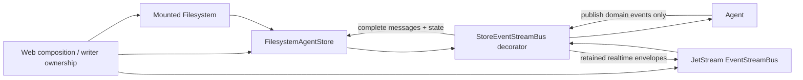

# Agent Event Storage Decorator Design

## Status

This document replaces the earlier design section that injected store
storage into `Agent`. It records the approved end state: `Agent` knows only an
`EventStreamBus`; persistence and retained streaming are composed outside the
runtime loop with a decorator. This document is local design material and must
not be committed.

## Goals

- Remove every store field, import, method, error, and resume path from
  `wyse-agent`.
- Keep `Agent` responsible only for running the model/tool loop, maintaining its
  active in-memory history, and publishing typed events.
- Persist Agent metadata in `agent.json` and complete messages in
  `messages/{seq}.json` through the mounted `wyse-filesystem` abstraction.
- Allocate one Agent-lifetime, monotonically increasing business `seq` only
  when a complete user, assistant, or tool message is committed.
- Keep text, reasoning, and tool-call deltas unsequenced and available only in
  the realtime retained stream.
- Keep store history and JetStream independent: store is durable
  message history; JetStream is a file-backed retained event cache.
- Preserve the fixed-barrier history pagination plus live-subscription recovery
  flow already designed for readers.
- Delete obsolete store snapshots, Agent resume code, compatibility code,
  and tests that exist only for those contracts.

## Non-goals

- Agent creation, ownership, ACL, mount creation, or writer election. Web crates
  provide an already-authorized mount and enforce the single creator/writer.
- Reconstructing or resuming an interrupted model/tool loop inside `Agent`.
- Replaying text, reasoning, or tool-call deltas from store files.
- Backfilling store history into JetStream. JetStream uses its own file
  storage; a reader fills stable gaps from store and then follows the
  retained/live stream.
- Atomic commit across the filesystem backend and JetStream.
- Migration, dual-write, legacy formats, feature flags, or compatibility
  adapters.
- New manager, repository, factory, or facade layers.

## Selected architecture

Three alternatives were considered:

1. **Selected: an `EventStreamBus` decorator in `wyse-store`.** `Agent`
   publishes uncommitted domain envelopes. The decorator persists state-bearing
   events, assigns `seq` to complete messages, and forwards the resulting
   envelope to an injected inner retained bus. This gives the requested
   dependency direction without adding another Agent-facing trait.
2. Keep store calls in `Agent` and hide them behind helpers. This leaves
   storage ordering, retries, and storage errors in the runtime loop and does
   not meet the decoupling goal.
3. Introduce separate `EventSink`, `EventStore`, and `EventSource` traits. This
   can model every stage explicitly but adds abstractions with no second use
   case and duplicates the existing bus boundary.

The dependency graph is:



`wyse-agent` depends on `wyse-core`, `wyse-infra`, LLM, and tool crates. It no
longer depends on `wyse-store`. `wyse-store` depends on
`wyse-filesystem`, `wyse-core`, and `wyse-infra` so it can implement the bus
decorator without creating a dependency cycle.

## Event contract

`AgentEvent::Message` is an uncommitted domain event:

```rust
AgentEvent::Message {
    turn_id: TurnId,
    message: ChatMessage,
}
```

Business sequence belongs to the envelope rather than the Agent-created event:

```rust
pub struct StreamEnvelope {
    pub business_seq: Option<u64>,
    pub run_id: RunId,
    pub timestamp: DateTime<Utc>,
    pub source: EventSource,
    pub event: RuntimeEvent,
    pub metadata: BTreeMap<String, Value>,
}
```

`Agent` always publishes `business_seq: None`. The decorator changes it to
`Some(seq)` only after `AgentStore::append_message` has committed the
complete message. Every persisted `messages/{seq}.json` and every forwarded
JetStream copy of that message therefore contains the same concrete `seq`.
Lifecycle events and all deltas keep `None`.

State-bearing lifecycle events contain the data the decorator needs; it does
not inspect Agent internals:

- `Started { turn_id }` selects `Running` and records the envelope `run_id`.
- `Finished { finish_reason, usage }` selects `Finished`.
- `Failed { error_text, usage }` selects `Failed`.
- `Cancelled { usage }` selects `Cancelled`.

`WaitingRetry` disappears. Retry/resume belonged to the removed persisted-loop
loop contract and is not retained for compatibility.

## Agent publication flow

For one turn, `Agent` publishes:

1. required `Started { turn_id }`;
2. required complete user `Message`;
3. best-effort LLM lifecycle and delta events while collecting the response;
4. required complete assistant `Message`;
5. for every executed tool, required complete tool `Message`;
6. required `Finished`, `Failed`, or `Cancelled` carrying current usage.

“Required” is an event-delivery invariant, not knowledge of storage. If the
injected bus rejects a state-bearing or complete-message event, `Agent` stops
the active turn rather than maintaining an externally incomplete history.
Realtime delta publication remains best effort. Tool approval requests remain
required because the loop cannot continue without delivering them.

The active in-memory `Vec<ChatMessage>` remains inside `Agent`; it is needed to
construct subsequent LLM requests. No persisted history is loaded by the Agent
builder, and the old `resume`, `resume_turn`, sequence atomics, store
payload codec, and store-specific errors are deleted.

## Decorator write flow

`StoreEventStreamBus` wraps exactly two injected values:

```rust
pub struct StoreEventStreamBus {
    store: Arc<dyn AgentStore>,
    inner: Arc<dyn EventStreamBus>,
}
```

Its `publish` behavior is event-driven:

- `Started`, `Finished`, `Failed`, and `Cancelled`: update `agent.json` through
  store CAS, then forward the unchanged envelope.
- `Message`: call `append_message(envelope)`. The store allocates the next
  `seq`, writes `messages/{seq}.json` with `CasExpectation::Absent`, CAS-advances
  `agent.json.last_seq`, and returns the sequenced envelope. The decorator
  forwards that returned envelope.
- Approval and LLM events: forward directly without store access.

Store failure is returned as `EventStreamBusError::Persistence` and is
fail-closed. Once a stable event is committed, a subsequent inner-bus failure
is logged but does not roll back or invalidate store history. Non-stable
events return the inner bus result normally.

`subscribe_agent` delegates directly to the inner bus. The decorator does not
merge streams, synthesize deltas, or hide recovery orchestration.

## Store format and CAS

The existing mounted-filesystem layout remains authoritative:

```text
<agent-root>/agent.json
<agent-root>/messages/1.json
<agent-root>/messages/2.json
...
```

`agent.json` contains only:

- `state_version`
- `agent_id`
- `name`
- `status`
- `run_id`
- `turn_id`
- `usage`
- `last_seq`
- `updated_at`

`AgentStore::append_message` accepts an unsequenced `StreamEnvelope` and
returns the committed envelope with `business_seq = Some(seq)`. The existing
CAS rules remain unchanged: immutable message creation uses `Absent`; the
frontier update uses the version read from `agent.json`; retries re-read and
reapply; business code never uses `Any`; unsupported CAS fails closed.

## Retained stream and reader recovery

JetStream continues to use file storage with explicit `max_age`, `max_bytes`,
`max_messages`, discard-old, and replica settings. Its opaque `EventCursor` is
transport state and never replaces the business sequence.

A reconnecting reader with last rendered `front_seq` performs the existing
barrier flow:

1. subscribe to new Agent events and buffer them;
2. load the first store page after `front_seq`; that page fixes
   `through_seq = agent.json.last_seq`;
3. load remaining pages with the same `through_seq`;
4. render store messages in sequence order;
5. discard buffered stable messages with `business_seq <= through_seq`;
6. render the remaining buffered events and continue the live subscription.

This avoids a cross-system transaction and closes the history/live race. A
JetStream disconnect affects realtime delivery only; store remains the
source for complete-message recovery after refresh.

## Testing and deletion

Keep tests that prove current invariants:

- core serialization and `business_seq` placement;
- filesystem CAS append, contiguous frontier, corruption detection, and fixed
  pagination;
- decorator routing, state mapping, seq assignment, durable-first behavior,
  and direct subscription delegation;
- Agent publication of user/assistant/tool messages without store types;
- JetStream file retention and cursor replay;
- store-plus-live recovery barrier.

Delete tests for old snapshot records, payload codecs, retryable store
resume, Agent store builder fields, and compatibility behavior. Final
verification includes a repository search proving `wyse-agent` contains no
store references and a workspace-wide format, test, and Clippy pass.

## Documentation order

`TODO.md` and crate `AGENTS.md` Mermaid documentation are the final
implementation task. `TODO.md` records only capabilities intentionally deferred
by this crate, not execution steps. The Mermaid diagram records the final
implemented dependency and recovery flows. Superpowers documents stay local and
uncommitted.
